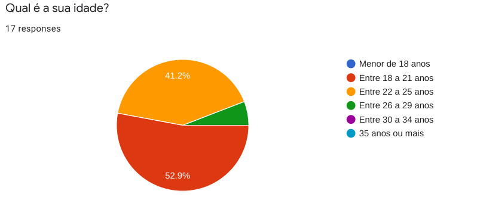

# Perfil de Usuários:

## Objetivo:

O objetivo principal desse módulo é traçar um perfil de usuário que revele de maneira clara as principais características dos nossos usuários.
 
Tendo em vista o escopo do nosso projeto, sobre uma plataforma educacional e focado na visão do aluno, já temos de antemão algumas informações, como ocupação (estudantes universitários) e escolaridade (ensino superior). A partir disso, escolhemos o método de aplicação de questionário, devido a sua velocidade de coleta de dados, da grande quantidade de usuários que pode ser alcançada e a facilidade de analisar os dados que podem ser apresentados de forma gráfica. Assim, podemos reunir ainda mais informações e traçar o perfil dos usuários, focando em sua relação com a plataforma SAE.
 

## Resultados:
 

### Dados dos usuários:
 

 

 
 
 

### Relação entre usuário e a plataforma SAE:
 

 

 

 

 

 

 
 

Além dessas perguntas, foram coletadas sugestões dos usuários para melhorias na plataforma SAE. Essas sugestões serão utilizadas posteriormente 
 

## Conclusão:

Pode-se perceber, que:
* A maioria dos usuários tem entre 18 e 25 anos e são estudantes de Engenharia de Software.
* O SAE é utilizado principalmente nas matérias de Algorítmos e Programação de Computadores (APC) e Banco de Dados.
* Os recursos mais utilizados do SAE são Responder listas de questões, assinar chamada, realizar provas e responder questões avulsas.
* Poucos usuários estão satisfeitos com a usabilidade da plataforma SAE.
 

## Versionamento:

| Data:      | Versão: | Descrição:           | Autor:                       |
|------------|---------|----------------------|------------------------------|
| 03/10/2020 | 0.1     | Criação do formulário de pesquisa | Rafael Ribeiro |
| 05/10/2020 | 1.0     | Criação da Página com perfis de usuários | Gabriel Paiva e Murilo Gomes |