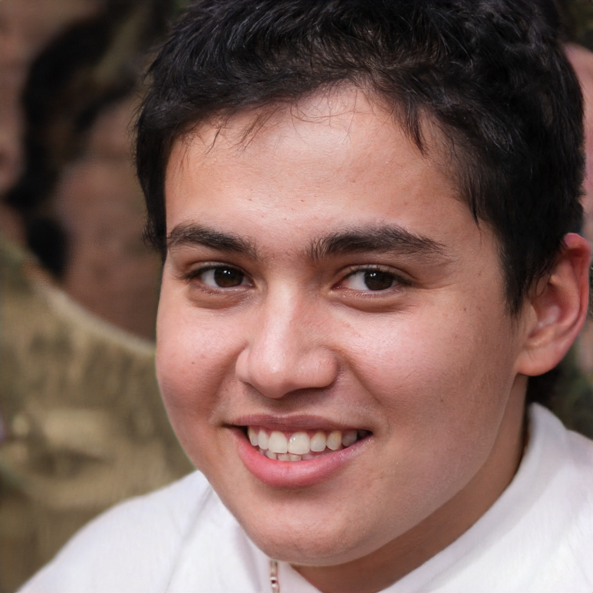

# Personas:

## O que é uma persona?

Uma persona é um personagem fictício, arquétipo hipotético de um grupo de usuários reais, criada para descrever um usuário típico [1].
No caso desse projeto, as personas a seguir são baseadas principalmente em alunos do curso de Engenharia, com no no curso de Engenharia de Software, afinal esses são os principais usuários do SAE atualmente segundo a pesquisa de perfil do usuário.
Ainda acerca de tais personas, as idades, características, objetivos e sugestões podem ser as mais variadas, afinal o ponto principal da aplicação é que ela é voltada a atender alunos reais, então mesmo que essas áreas sejam variadas e que personas sejam ficcionais por definição, tais personas são satisfatórias.

## Objetivos
O objetivo principal das personas é chamar a atenção dos desenvolvedores para como são os usuários finais e quais serão as necessidades supridas pelo projeto.

## Nossas personas:

                                  

|                         |                                                                                                                                                                                                                             |
|-------------------------|-------------------------------------------------------------------------------------------------------------------------------------------------------------------------------------------------------------------------------------------------------------------------------------|
| Nome:                   | Diego Fernandes                                                                                                                                                                                                                                                                     |
| Idade:                  | 18 anos                                                                                                                                                                                                                                                                             |
| Ocupação:               | Estudante de Engenharia de Software                                                                                                                                                                                                                                                 |
| Características:        | - Acabou de ingressar na faculdade. - Pouco conhecimento de programação e tecnologias. - Utiliza o SAE na disciplina de APC, para assinar a chamada, consultar monitoria, responder listas de questões e realizar provas.                                                     |
| Objetivos:              | Pessoais: - Aprender a utilizar as ferramentas da faculdade com maior facilidade, para que possa focar mais nas matérias do primeiro semestre.  Práticos: - Realizar as tarefas que necessitam do SAE sem que tenha dificuldade de aprender a utilizar essa ferramenta. |
| Sugestão ou Reclamação: | - Dificuldade de compreensão de suas ferramentas(do que elas fazem), dificuldade na hora de escolher a turma em qualquer uma das opções (janela não abre no formato ideal, toda vez precisa de abrir uma janela para poder procurar uma turma).                                     |

 
 

|                         |                                                                                                                                                                                                                     |
|-------------------------|-------------------------------------------------------------------------------------------------------------------------------------------------------------------------------------------------------------------------------------------|
| Nome:                   | Jaqueline Dias                                                                                                                                                                                                                            |
| Idade:                  | 22 anos                                                                                                                                                                                                                                   |
| Ocupação:               | Estudante de Engenharia de Software, 6° semestre.                                                                                                                                                                                         |
| Características:        | - Alto conhecimento em programação e tecnologias. - Têm experiência com outras ferramentas da faculdade. - Utiliza o SAE na disciplina de Banco de Dados 1, para assinar a chamada, responder listas de questões e realizar provas. |
| Objetivos:              | Pessoais: - Conciliar faculdade e estágio sem perder performance em nenhum dos dois.  Práticos: - Realizar as tarefas que necessitam do SAE da forma mais rápida possível.                                                    |
| Sugestão ou Reclamação: | - O site SAE tinha que se preocupar minimamente com a usabilidade do seu sistema.                                                                                                                   |
 
 

|                         |                                                                                                                                                                                                                     |
|-------------------------|-------------------------------------------------------------------------------------------------------------------------------------------------------------------------------------------------------------------------------------------|
| Nome:                   | Maísa Morais                                                                                                                                                                                                                            |
| Idade:                  | 20 anos                                                                                                                                                                                                                                   |
| Ocupação:               | Estudante de Engenharia, 2° semestre.                                                                                                                                                                                         |
| Características:        | - Gosta das disciplinas na área de exatas. - Gosta de assistir séries de TV. - Ainda tem dúvidas sobre qual engenharia cursar. |
| Objetivos:              | Pessoais: - Se formar e morar fora do país. - Conseguir um bom emprego  Práticos: - Conseguir usufruir de toda a experiência que lhe é proporcionada.                                                    |
| Sugestão ou Reclamação: | - As vezes não consegue acompanhar tudo o que acontece no meio academico.                                                                                                                   |
 
 

|                         |                                                                                                                                                                                                                     |
|-------------------------|-------------------------------------------------------------------------------------------------------------------------------------------------------------------------------------------------------------------------------------------|
| Nome:                   | Bernardo Melo                                                                                                                                                                                                                            |
| Idade:                  | 33 anos                                                                                                                                                                                                                                   |
| Ocupação:               | Gerente regional de uma multinacional.                                                                                                                                                                                         |
| Características:        | - Pratica esportes no tempo livre. - Casado e possui uma filha de dois anos. - Sempre tentando subir na carreira. |
| Objetivos:              | Pessoais: - Proporcionar uma vida tranquila para sua família.  Práticos: - Se especializar nas novas tendencias do mercado.                                                    |
| Sugestão ou Reclamação: | - Se queixa de não ter  aprendido inglês quando era mais jovem.                                                                                                                   |
## Referências

[1] [BARBOSA, Simone Diniz Junqueira; DA SILVA, Bruno Santana. Interação humano-computador. Capítulo 6 - Organização do Espaço de Problema. Elsevier, 2010. Disponibilizado no material de apoio da turma.](https://aprender3.unb.br/pluginfile.php/545944/mod_resource/content/4/Simone_Barbosa_Bruno-Interacao_humano_computador%20Cap%206%20Organizacao%20.pdf)

[2] [Fotos Retidas do site This Person Does Not Exist](https://www.thispersondoesnotexist.com/)

 
 

## Versionamento:

| Data:      | Versão: | Descrição:           | Autor:                       |
|------------|---------|----------------------|------------------------------|
| 04/10/2020 | 1.0     | Criação das Personas | Gabriel Paiva e Murilo Gomes |
| 04/11/2020 | 2.0     | - Criação de mais uma persona e uma antipersona  - Mudança para fotos criadas por AI | Rafael Ribeiro |
| 30/11/2020 | 3.0     | Adição de mais conteúdo acerca do que são personas e do objetivo delas | Rafael Ribeiro |

