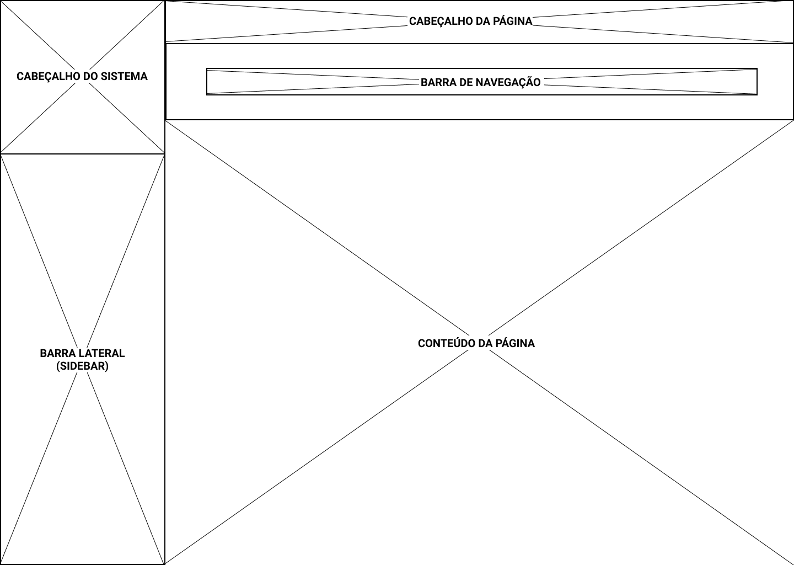

# Guia de Estilo
 
É comum, principalmente em projetos grandes, reunir os princípios e as diretrizes adotados em um documento intitulado guia de estilo. Trata-se de um registro das principais decisões de design tomadas, de forma que elas não se percam, isto é, sejam efetivamente incorporadas no produto final. Guias de estilo servem de ferramenta de comunicação entre os membros da equipe de design e também com a equipe de desenvolvimento. É importante que as decisões de design possam ser facilmente consultadas e reutilizadas nas discussões sobre extensões ou versões futuras do produto [1]. 
 
Um guia de estilo deve incorporar decisões de design envolvendo os principais elementos e considerações de design de interface. Marcus (1992) considera os seguintes elementos:
 
1. Layout: proporção e grids; uso de metáforas espaciais; design gráfico de exibidores e ferramentas;
 
2. Tipografia e seu uso em diálogos, formulários e relatórios; 
 
3. Simbolismo: clareza e consistência no design de ícones; Cores: os dez mandamentos sobre o uso de cores;
 
4. Visualização de informação: design de gráficos, diagramas e mapas; Design de telas e elementos de interface (widgets). 
 
## Guia de Estilo Para o SAE: 
 
**1. Introdução:**
 
   **1.1. Objetivo do Guia de Estilo:**

   O objetivo deste guia de estilo é registrar as principais decisões de design tomadas pelo grupo, de forma que elas sejam efetivamente incorporadas no produto final, que será a elaboração de um protótipo.

   **1.2. Organização e Conteúdo do Guia de Estilo:**

   Após análise prévia do site do SAE, será feita uma reformulação, mantendo a tipografia, simbolismo e cores, mas tentando melhorar o layout e a visualização de informações.

   **1.3. Público-alvo do guia de estilos:**

   O público alvo é a própria equipe da disciplina de IHC que fará a reformulação do sistema para criar um protótipo.

   **1.4. Como manter o guia:**

   O guia de estilo deve ser atualizado sempre que houver uma nova decisão sobre o estilo do site, novas funcionalidades, etc.
 
**2. Resultados da Análise:**

   **2.1. Descrição do Ambiente de Trabalho:**

   No primeiro momento, o usuário se depara com uma página de login obrigatório. Após logar, ele é redirecionado para uma página com uma barra lateral (sidebar), um menu central e uma barra de navegação, sendo essas duas últimas com as mesmas opções: Questões, Orientação, Cooperação, Chat, Monitoria, Usuário e Material. Clicando em qualquer uma dessas opções, a barra lateral é atualizada com novas opções ou novas janelas são abertas, como no caso do Chat.
 
**3. Elementos da Interface:**

   **3.1. Disposição espacial e grid:**

   A disposição espacial do SAE parece repetitiva e com mau uso do espaço disponível. Existem diversos cabeçalhos e barras de navegação que podem acabar confundindo o usuário, causando uma má experiência. Alguns elementos da tela, devido a sua forma e cor, podem ter suas funcionalidades confundidas. Veja abaixo, como os elementos são distribuídos na tela atualmente no SAE:

   

   **3.2. Janelas:**

   A maioria das janelas seguem a padronização descrita no item anterior. As exceções são janelas que abrem para o usuário escolher sua turma ou para acessar o chat.

   

   **3.3. Tipografia:**

   As principais fontes utilizadas no site são: Arial e Verdana

   

   

   **3.4. Símbolos não Tipográficos:**

   Os símbolos utilizados no SAE atualmente possuem um design ultrapassado, portanto planejamos substituir esses símbolos por uma representação mais moderna, extraídos da biblioteca open-source “Feather Icons”.

   **3.5. Cores:**

   

   **3.6. Animações:**

   O site não possui animações.
 
**4. Elementos de Interação:**

   **4.1. Estilos de Interação:**

   O site trabalha com interações a partir dos menus de navegação (tanto superior, quanto lateral) e formulários para pesquisar turmas, listas ou outras informações que podem ser encontradas no site.

   **4.2. Seleção de um Estilo:**

   O sistema oferece um conjunto de opções nas barras de navegação, dentre as quais o usuário deve selecionar a que lhe interessa.

   **4.3. Aceleradores:**

   O site não possui aceleradores.
 
**5. Elementos de Ação:**

   **5.1. Preenchimento de Campos:**

   Para logar, pesquisar turma por código ou nome da disciplina, entre outras tarefas, é necessário preencher os campos, não sendo possível prosseguir sem preenchê-los.

   **5.2. Seleção:**

   Existem inputs de seleção em partes do site como: escolher tipos, categorias e dificuldades de questões; ano e semestre da turma; entre outros.

   **5.3. Ativação:**

   Na página inicial do SAE, pode-se navegar pelas opções de Questões, Orientação, Cooperação, Chat, Monitoria, Usuário e Material através de um Menu de Ativação. No protótipo construído pela equipe, esse menu será removido, sendo utilizado somente a Barra de Navegação que já tem as mesmas opções.

 
**6. Vocabulário e Padrões:**

   **6.1. Terminologia:**

   O SAE conta com terminologias usadas em ambiente acadêmico, ligadas a um foco didático, de forma objetiva e de fácil compreensão.
 
   **6.2. Tipos de Tela:**

   As páginas devem possuir um cabeçalho de identificação da página atual, um menu de navegação e as informações e utilidades principais de cada página em seu corpo. Em formulários, os inputs devem substituir o corpo da página.
 
## Referências:

* [1] BARBOSA, Simone Diniz Junqueira; DA SILVA, Bruno Santana. Interação humano-computador. Capítulo 8 - Princípios e Diretrizes para o Design de IHC. Elsevier, 2010. Disponibilizado no material de apoio da turma.

* Site do SAE, perfil de Aluno.
 
## Versionamento:
 
| Data:      | Versão: | Descrição:           | Autor:                       |
|------------|---------|----------------------|------------------------------|
| 14/10/2020 | 1.0     | Criação do Guia de Estilo | Gabriel Paiva e Murilo Gomes |