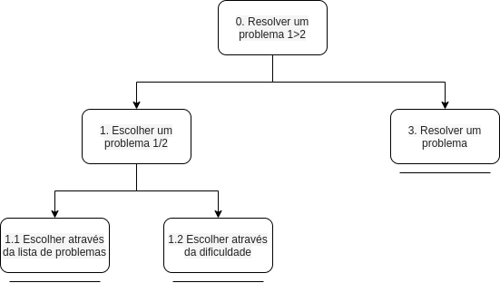

Análise de Tarefas 
==================

  

> A análise de tarefas é a atividade que busca ter um entendimento sobre
> o trabalho dos usuário, como eles realizam este trabalho e o por quê.
> Nela nós visamos representar todos os métodos de coletar, classificar
> e interpretar dados que nos ajudem a entender o desempenho de um
> sistema.

  

Em IHC a análise de tarefas é geralmente utilizada em três atividades

habituais, são elas:

  

- Para a análise da situação atual. (Que pode ser apoiada ou não por

um sistema computacional.)

- Para o (re)design de um sistema computacional.

- Para a avaliação do resultado de uma intervenção que inclua um novo

sistema computacional.

  

Existem diversos métodos de análise de tarefas, no entanto os mais

comuns, e que também serão utilizados neste trabalho são:

  

- Análise Hierárquica de tarefas (AHT)

- GOMS (Goals, Operators, Methods and Selection Rules)

  

* * * * *

## Análise Hierárquica de tarefas (AHT)

  
A análise hierárquica de tarefas foi desenvolvida em 1960 com o objetivo
de entender as competências envolvidas nas tarefas do usuário, esta
avalia primeiro os objetivos de alto nível dos usuários, decompondo-os
em subobjetivos.

  

### Objetivos dos Usuários 

> Os objetivos são as ações que os usuários desejam executar, estes são
> o nível mais alto da hierarquia de objetivos, quando um objetivo
> precisa executar mais de uma tarefa para ser finalizado, chamamos
> essas tarefas de **subobjetivos**. Já a relação entre um objetivo e
> seus subobjetivos são chamadas de **planos**, por fim, quando nós
> chegamos no nível mais baixo da hierarquia temos uma operação que é
> quando atingimos um objetivo ou subjetivo.

  

  

| Objetivos/Operações | Problemas e Recomendações |  |  |
|-|-|-|-|
| 0. Resolver um problema 1>2 | **input**: Resolver uma questão avulsa  **feedback**: Atualiza o seu número de problemas resolvidos e gera dados para MINa  **plano**: Resolver uma questão de um conteúdo já estudado  **recomendação**: observar o estado da resposta para saber se ela estava correta
|  |  |
| 1. Escolher um problema 1/2 | **plano**: Escolher dentre uma lista de conteúdos suas respectivas questões, ajustando o tipo de questão, dificuldade e categoria. |  |  |
| 1.1 Escolher através da lista de problemas |  |  |  |
| 1.2 Escolher através da dificuldade |  |  |  |
| 3. Resolver  um problema | **input**: Enviar resposta da questão  **feedback**: O sistema irá avisar se sua resposta foi correta ou não. Se não for correta, ele indicará o erro |  |  |

- Tabela 1. Tabela de representação de tarefas da AHT do obejetivo "Resolver problemas"

### GOMS

  

O GOMS(\*Goals, Operators, Methods and Selection Rules\* - Objetivos,
Operadores, Métodos e Regras de Seleção) foi criado para analisar o
desempenho de usuários competentes de sistemas computacionais,
realizando tarefas dentro da sua competência e sem cometer erros. Esse
modelo têm se mostrado úteis para prever o desempenho, ou seja, predizer
o impacto de decisões de design no desempenho competente.

O GOMS é um método para descrever uma tarefa e o conhecimento do usuário sobre como realizá-la em termos de objetivos(\*goals\*),
operadores(\*operators\*), métodos (\*methods\*) e regras de seleção
(\*selection rules\*).

- Os \*\*objetivos\*\* representam o que o usuário quer realizar

utilizando o software

  

- Um exemplo de objetivo no SAE é realizar uma lista de exercícios

- Os \*\*operadores\*\* são primitivas internas ou externas, as ações

concretas que o software permite que os usuários façam.

- Nas listas realizadas pelos alunos, há questões discursivas onde é

inserido dados que são enviados para serem corrigidas pelo professor.

  

- Os \*\*métodos\*\* são sequências bem conhecidas de subobjetivos e

operadores que permitem atingir um objetivo maior.

  

- Para realizar uma lista, o usuário deve seguir uma série de passos

até a conclusão de seu objetivo.

  

- As \*\*regras de seleção\*\* acontece quando há mais do que um método

para atingir um mesmo objetivo. Elas representam tomadas de decisão dos

usuários sobre qual método utilizar numa determinada situação.

  

- Quando objetivo é ter um feedback de como o usuário está se saindo

nos conteúdos da disciplina, a inteligência artificial MINa realiza essa

avaliação e indica para o usuário como ele está se saindo. É possível

chegar a esse objetivo de duas maneiras, solicitando orientação ou

consultando o relatório.

  

### KLM-GOMS

  

O KLM é a técnica mais simples de GOMS, limitada a um conjunto

predefinido pelos seguintes operadores primitivos:

  

- \*\*K\*\* para pressionar uma tecla ou botão;

  

- \*\*P\*\* para apontar com o mouse um alvo num dispositivo visual;

  

- \*\*H\*\* para mover as mãos para o teclado ou outro dispositivo;

  

- \*\*D\*\* para desenhar um segmento de reta em um grid;

  

- \*\*M\*\* para se preparar mentalmente para realizar uma ação ou uma

série de ações primitivas fortemente relacionadas entre si;

  

- \*\*R\*\* para o tempo de resposta do sistema, durante o qual o

usuário

  
Tabela 1. Algumas operações do KLM-GOMS e suas durações médias

| operação | duração média |
|--|--|
| **K**: pressionar e soltar uma tecla do teclado(média) | 0,20s |
| **P**: apontar o cursor do mouse num objeto de tela | 1,10s
| **B**: pressionar ou soltar o botão do mouse | 0,10s
| **H**: levar a mão do teclado ao mouse ou vice-versa | 0,40s
| **M**: preparação mental | 1,20s
| **T**(n): digitação de cadeia de caracteres | n x K s
|**W**(t): espera pela resposta do sistema | depende do sistema

* * * * *

  

Tabela 2. Análise da Tarefa: Pedir orientação

| Método | operador | descrição | tempo (s) |
|-|-|-|-|
| Orientação  Solicitar > Turma | M | preparação | 1,50 |
|  | P | Levar cursor até botão Orientação | 1,00 |
|  | B | pressionar o botão Orientação | 0,20 |
|  | B | Soltar o botão do mouse | 0,20 |
|  | P | Levar cursor até botão Orientação na barra lateral | 1,10 |
|  | B | pressionar o botão Orientação | 0,20 |
|  | B | Soltar o botão do mouse | 0,20 |
|  | P | Levar cursor até botão Solicitar | 0,80 |
|  | B | pressionar o botão Solicitar | 0,20 |
|  | B | Soltar o botão do mouse | 0,20 |
|  | P | Levar cursor até botão da Turma | 1,50 |
|  | B | pressionar o botão da Turma | 0,20 |
|  | B | Soltar o botão do mouse | 0,20 |
|  | W | Espera total para resposta do sistema | 10,32 |
|  |  TOTAL |  | 17,82 |
| Orientação  Relatório > Turma | M | preparação | 1,50 |
|  | P | Levar cursor até botão Orientação | 1,00 |
|  | B | pressionar o botão Orientação | 0,20 |
|  | B | Soltar o botão do mouse | 0,20 |
|  | P | Levar cursor até botão Orientação na barra lateral | 1,10 |
|  | B | pressionar o botão Orientação | 0,20 |
|  | B | Soltar o botão do mouse | 0,20 |
|  | P | Levar cursor até botão Relatório | 0,90 |
|  | B | pressionar o botão Relatório | 0,20 |
|  | B | Soltar o botão do mouse | 0,20 |
|  | P | Levar cursor até botão da Turma | 1,50 |
|  | B | pressionar o botão da Turma | 0,20 |
|  | B | Soltar o botão do mouse | 0,20 |
|  | W | Espera total para resposta do sistema | 5,11 |
|  |  TOTAL |  | 12,61 |

* * * * *

  

Tabela 2. Análise da Tarefa: Pedir orientação

  
| Método | operador | descrição | tempo (s) |
|-|-|-|-|
| Monitoria Monitoria > Pesquisar Monitoria | M | preparação | 1,50 |
|  | P | Levar cursor até botão Monitoria | 1,00 |
|  | B | pressionar o botão Monitoria | 0,20 |
|  | B | Soltar o botão do mouse | 0,20 |
|  | P | Levar cursor até botão Monitoria na barra lateral | 1,10 |
|  | B | pressionar o botão Monitoria | 0,20 |
|  | B | Soltar o botão do mouse | 0,20 |
|  | P | Levar cursor até ícone do botão Pesquisar ao lado do campo Disciplina | 1,50 |
|  | B | pressionar o ícone do botão Pesquisar | 0,20 |
|  | B | Soltar o botão do mouse | 0,20 |
|  | P | Levar cursor até botão da Turma | 1,30 |
|  | B | pressionar o botão Turma | 0,20 |
|  | B | Soltar o botão do mouse | 0,20 |
|  | P | Levar cursor até botão Pesquisar Monitoria | 1,10 |
|  | B | pressionar o botão Pesquisar Monitoria | 0,20 |
|  | B | Soltar o botão do mouse | 0,20 |
|  | W | Espera total para resposta do sistema | 6,84 |
|  |  TOTAL |  | 16,34 |

### CMN-GOMS

  

O CMN-GOMS possui uma hierarquia estrita de objetivos, os operadores são

executados estritamente em ordem sequencial, e os métodos são

representados numa notação semelhante a um pseudocódigo, que inclui

submétodos e condicionais. Ao elaborar esse modelo, devemos definir

cuidadosamente o que representar e o que não representar. Tarefas

mentais podem ser complexas, mas apenas aquelas que estejam relacionadas

ao design do sistema devem ser incluídas no modelo.Além disso, o nível

de detalhes utilizado deve atender aos objetivos da análise. Em etapas

iniciais, costumamos representar as estratégias alternartivas que o

usuário poderá seguir para atingir seus objetivos. Já para uma análise

mais precisa do desempenho, os passos são mais detalhados.

  

Exemplo 1 - Modelo CMN-GOMS Sem detalhes

  

\* GOAL 0: Fazer questões avulsas

  

+ GOAL 1: Encontrar o conteúdo

  

+ METHOD 1.A: Encontrar através do menu Questões

  

+ OP. 1.A.1: deslocar o cursor do mouse até o botão Questões

  

+ OP. 1.A.2: clicar com o botão esquerdo do mouse

  

+ OP. 1.A.3: deslocar o cursor do mouse até o botão Questões no

menu lateral

  

+ OP. 1.A.4: clicar com o botão esquerdo do mouse

  

+ OP. 1.A.5: deslocar o cursor do mouse até o ícone de Pesquisar

no campo Disciplina

  

+ OP. 1.A.6: clicar com o botão esquerdo do mouse

  

+ OP. 1.A.7: deslocar o cursor do mouse até o botão da Disciplina

desejada

  

+ OP. 1.A.8: clicar com o botão esquerdo do mouse

  

+ OP. 1.A.9: deslocar o cursor do mouse até o ícone de Pesquisar

no campo Conteúdo

  

+ OP. 1.A.10: clicar com o botão esquerdo do mouse

  

+ OP. 1.A.11: deslocar o cursor do mouse até o botão do Conteúdo

desejado

  

+ OP. 1.A.12: clicar com o botão esquerdo do mouse

  

+ GOAL 1.A.13 Escolher tipo de questão

  

+ METHOD 1.A.13.A: selecionar o tipo de questão de acordo com

uma lista de tipos

  

+ (SEL. RULE: preferência do usuário)

  

+ OP. 1.A.13.A.1: deslocar o cursor do mouse para a lista de

Tipo de Questão

  

+ OP. 1.A.13.A.2: clicar com o botão esquerdo sobre o tipo de

lista desejado

  

+ GOAL 1.A.14 Escolher tipo de questão

  

+ METHOD 1.A.14.A: selecionar a dificuldade da questão de acordo

com uma lista de tipos

  

+ (SEL. RULE: preferência do usuário)

  

+ OP. 1.A.14.A.1: deslocar o cursor do mouse para a lista de

Dificuldade

  

+ OP. 1.A.14.A.2: clicar com o botão esquerdo sobre o tipo de

lista desejado

  

+ GOAL 1.A.15 Escolher tipo de questão

  

+ METHOD 1.A.15.A: selecionar a categoria da questão de acordo

com uma lista de tipos

  

+ (SEL. RULE: preferência do usuário)

  

+ OP. 1.A.15.A.1: deslocar o cursor do mouse para a lista de

Categoria

  

+ OP. 1.A.15.A.2: clicar com o botão esquerdo sobre o tipo de

lista desejado

  

+ GOAL 1.A.16 Ir para a página com as questões

  

+ OP. 1.A.16.1: deslocar o cursor do mouse até o botão Continuar

  

+ OP. 1.A.17.2: clicar com o botão esquerdo do mouse

  

## Referencia 
[SIMONE DINIZ JUNQUEIRO BARBOSA, BRUNO SANTANA DA SILVA, Interação Humano-Computador, Capítulo 6 - Organização do Espaço de Problema 1a . Edição, Editora Campus, 2010.](https://aprender3.unb.br/mod/resource/view.php?id=142388)

## Versionamento

Data | Versão | Descrição | Autor
---- | ------ | --------- | -----
14/10/2020 | 1.0 | Criação das metas de usabilidade | Rafael Ribeiro/  itallo gravina
24/10/2020 | 1.1 | Adicão das referências | Rafael Ribeiro