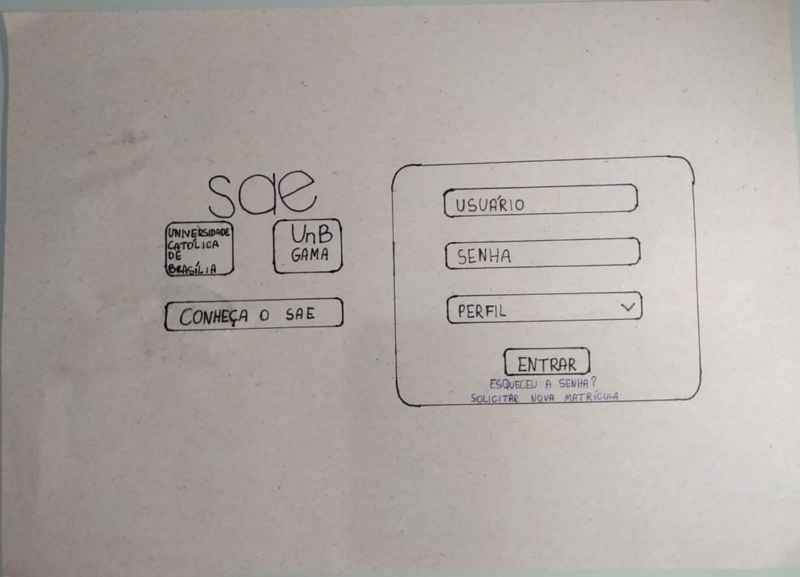
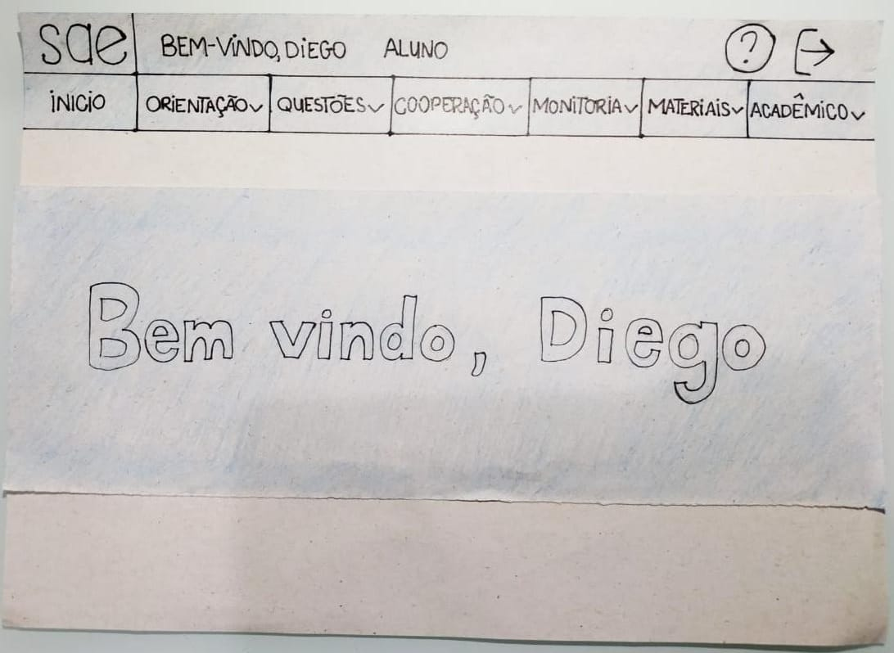
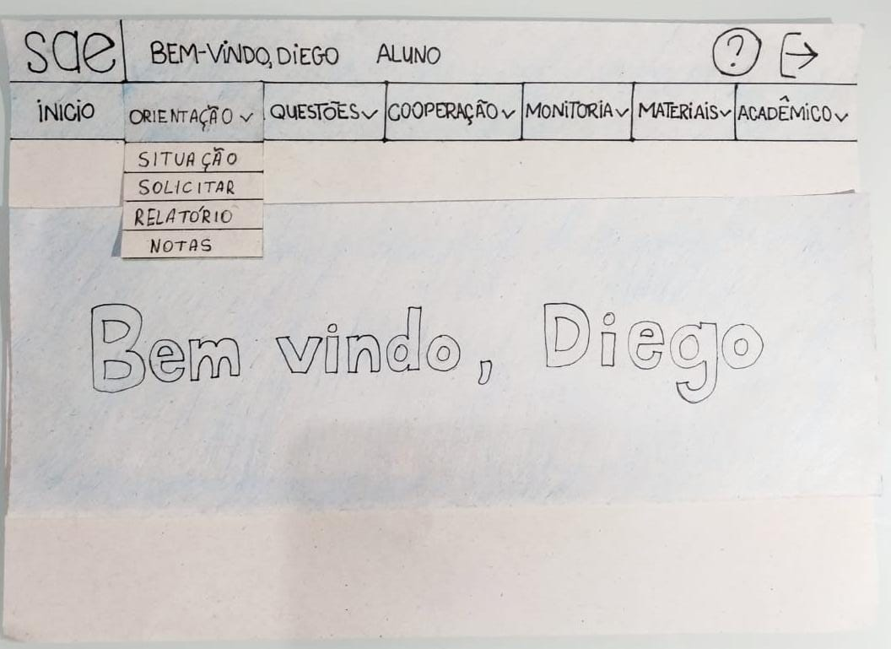
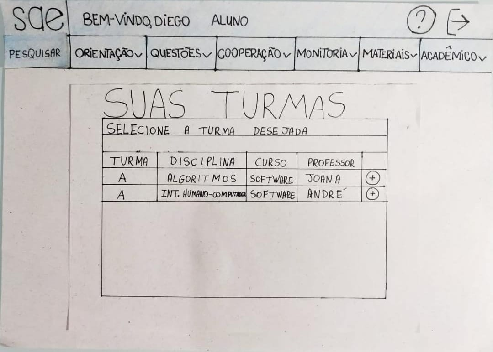
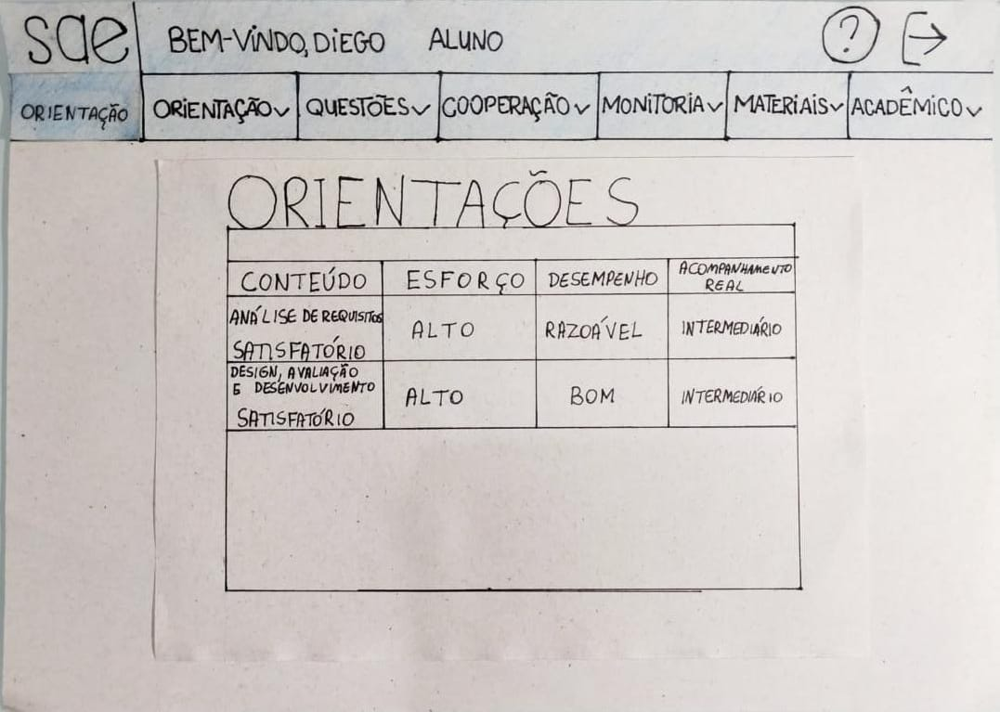
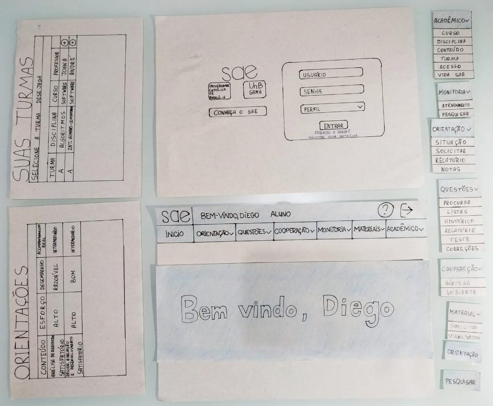
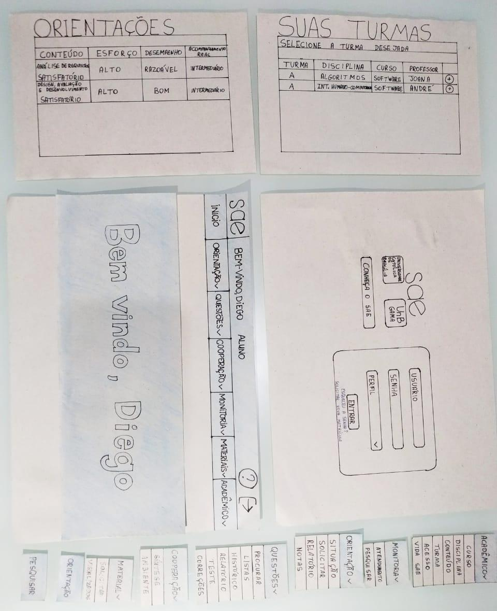

# Protótipo de Papel:

## Introdução:

## Protótipo de Papel do SAE:

Figura 1 - Página de Login na Prototipação em Papel.

Figura 2 - Página inicial na Prototipação em Papel.

Figura 3 - Funcionamento do Menu Dropdown na Prototipação em Papel.

Figura 4 - Página que lista as turmas do aluno em Prototipação em Papel.

Figura 5 - Página que mostra as orientações de uma determinada matéria ao aluno em Prototipação em Papel.

Figura 6 - Foto geral das figuras produzidas para a Prototipação em Papel.

Figura 6 - Outro ponto de vista geral das figuras produzidas para a Prototipação em Papel.

## Conclusão:

## Versionamento:
 Data:      | Versão: | Descrição:           | Autor:                       |
|------------|---------|----------------------|------------------------------|
| 04/11/2020 | 1.0     | Criação do Documento com a Prototipação em Papel | Gabriel Paiva |