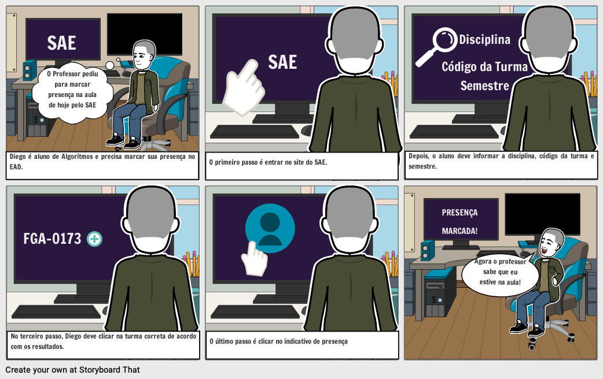
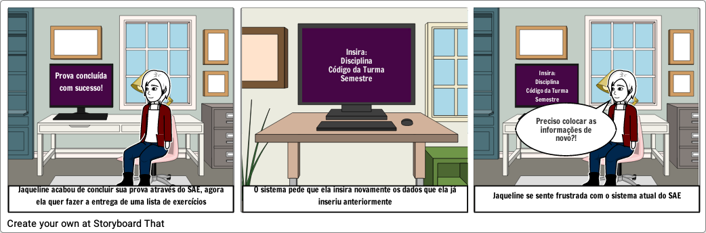

# StoryBoards

## Introdução:
Storyboard é um exemplo de prototipação de baixa-fidelidade, consistindo em uma série de desenhos mostrando como um usuário pode progredir em uma tarefa utilizando o produto que está sendo desenvolvido. Os Storyboards abaixo são referentes ao SAE, mostrando exemplo de tarefas que podem ser realizadas com sucesso nesse sistema e também exemplos de problemas de usabilidade encontrados pelos usuários.[1]

Abaixo se encontram 2 storyboards construídos com base em possíveis interações com o site do SAE.

## StoryBoard 1 : Assinar a chamada

### 1.1. Preparo:

* **Personagens envolvidos:** Diego Fernandes (Persona).

* **Ambiente da história:** Quarto do Diego.

* **Tarefa a ser abordada:** Assinar a chamada da aula.

### 1.2. Desenvolvimento da tarefa:

* **Passos envolvidos para realização da tarefa:** 
  * Acessar o site do SAE.
  * Inserir os dados requeridos.
  * Clicar na turma correta.
  * Clicar no indicativo de presença.

* **O que leva a pessoa a usar a aplicação?** Marcar presença das aulas no EAD.

* **Qual tarefa será ilustrada?** Diego irá assinar a chamada para informar o professor da presença do aluno na aula de APC.

### 1.3. Satisfação:
* **O que motiva as pessoas a quererem utilizar o sistema?** Assinar a chamada para provar sua presença.

* **Quais objetivos podem ser alcançados através do sistema?** Praticidade na hora de realizar a chamada, de forma remota e digital.

* **Quais necessidades que o sistema se propõe a sanar?** Permitir que a chamada seja respondida de forma prática, remota e digital por cada aluno.

Figura 1: Storyboard 1: Assinar a chamada

## StoryBoard 2 : Inserir informações repetidas vezes

### 2.1. Preparo:
* **Personagens envolvidos:** Jaqueline Dias (Persona).

* **Ambiente da história:** Quarto do Jaqueline.

* **Tarefa a ser abordada:** Entregar uma lista de exercícios após a resolução da prova.

### 2.2. Desenvolvimento da tarefa:

* **Passos envolvidos para realização da tarefa:**
  * Realizar a prova.
  * Inserir os dados da turma.
  * Clicar na turma correta.
  * Enviar a lista.

* **O que leva a pessoa a usar a aplicação?** Realizar tarefas relacionadas à disciplina como realizar provas, resolver exercícios, entre outras.

* **Qual tarefa será ilustrada?** Jaqueline irá entregar uma lista de exerccios após a resolução de uma prova, mas terá que inserir novamente as informações sobre a turma.

### 2.3. Satisfação:

* **O que motiva as pessoas a quererem utilizar o sistema?** 
Realizar diversas tarefas relacionadas a matéria, como realizar provas e resolver listas de exercícios. Entretanto, a realização das tarefas pode perder praticidade quando o usuário é obrigado a inserir as mesmas informações repetidas vezes.

* **Quais objetivos podem ser alcançados através do sistema?** 
Responder provas e responder listas de exercícios, de forma remota e digital.

* **Quais necessidades que o sistema se propõe a sanar?** Permitir que cada aluno responda provas e listas de questões de forma remota e digital.

Figura 2: StoryBoard 2: Inserir informações repetidas vezes.

## Referências:

* [1] JENNIFER PREECE & YVONNE ROGERS & HELEN SHARP. Design de Interação: Além da interação homem-computador. John Wiley e Sons. São Paulo - SP. 1ª Edição. Editora Erica, 2005.

* [Site do SAE](http://sae.ucb.br), perfil de Aluno (Acessado em 28/10/2020).

## Versionamento:
 Data:      | Versão: | Descrição:           | Autor:                       |
|------------|---------|----------------------|------------------------------|
| 14/10/2020 | 1.0     | Criação do Documento com os 2 StoryBoards | Gabriel Paiva, Murilo Gomes e Rodrigo Tiago |
