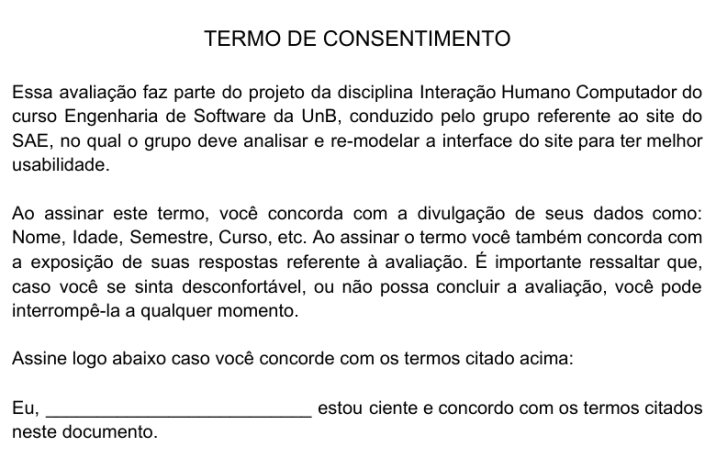

# Relato dos Resultados das Avaliações dos Storyboards

## 1 - Introdução:

Neste documento se encontra o relato dos resultados das avaliações dos Storyboards. Essa avaliação tem como objetivo avaliar se as tarefas descritas nos dois storyboards são de claro entendimento e se há maneiras de melhorar o desenvolvimento das mesmas.

## 2 - Participantes:

Para fazer a avaliação dos Storyboards houve a participação de dois avaliadores que fazem parte do projeto e são os que irão guiar a avaliação. E mais duas pessoas, que são participantes voluntários que irão ler e analisar os storyboards e depois responder perguntas sobre os mesmos, sendo uma dessas uma pessoa física que já utilizou o SAE uma vez, mas não utiliza hoje em dia (Eliseu Kadesh), e a outra uma persona, usuário frequente do sistema do SAE atualmente (Jaqueline Dias).

## 3 - Preparo:

Antes de começar a avaliação, entregamos um termo de consentimento para o participante assinar e executamos um teste piloto para coletar as principais informações do participante.

### 3.1 - Termo de Consentimento:

 

### 3.2 - Perguntas do Teste Piloto:

**Pergunta nº1:** Qual seu nome completo?

**Pergunta nº2:** Qual a sua idade?

**Pergunta nº3:** Qual o seu curso?

**Pergunta nº4:** Em que semestre você se encontra?

**Pergunta nº5:** Você já utilizou o site do SAE? Se sim, em que matéria?

**Pergunta nº6:** Como você considera a usabilidade do SAE? (Optativa)

- ( )Muito Ruim
- ( )Ruim 
- ( )Normal 
- ( )Boa 
- ( )Muito Boa 
- ( )Prefiro não responder

### 3.3 - Resultados do Teste Piloto:

Respostas do Usuário nº1 (Eliseu Kadesh):

**Qual seu nome completo?** Eliseu Kadesh Rosa Assunção Júnior.

**Qual a sua idade?** 20 anos.

**Qual o seu curso?** Engenharia de Software.

**Em que semestre você se encontra?** 5ºSemestre.

**Você já utilizou o site do SAE?** Se sim, em que matéria? Sim, utilizei na matéria APC do primeiro semestre.

**Como você considera a usabilidade do SAE?** Ruim

 
 
Respostas do Usuário nº2 (Jaqueline Dias):

**Qual seu nome completo?** Jaqueline Dias.

**Qual a sua idade?** 22 anos.

**Qual o seu curso?** Engenharia de Software.

**Em que semestre você se encontra?** 6ºSemestre.

**Você já utilizou o site do SAE? Se sim, em que matéria?** Sim, atualmente utilizo o SAE na matéria de Banco de Dados 1.

**Como você considera a usabilidade do SAE?** Muito Ruim.

 

## 4 - Execução:

A execução da avaliação ocorre da seguinte forma: para cada storyboard, o participante deve usar cerca de cinco minutos para lê-lo, e, logo depois de ler e analisar o storyboard, o participante deve responder seis questões sobre o storyboard que acabou de ler, enquanto um dos avaliadores deve fazia as perguntas, o outro anotava as respostas do participante, a execução das perguntas é calculado para durar em torno de cinco minutos, portanto, para cada storyboard a duração média é de 10 minutos, e, para a avaliação dos dois storyboards, é calculado um tempo total de 20 minutos. É importante ressaltar que, as avaliações com cada participante ocorreu em momentos diferentes, portanto, as respostas de um participante não interferiu nas do outro.

### 4.1 - Perguntas a serem feitas:

**Pergunta nº1:** O que aconteceu nesse Storyboard? 

**Pergunta nº2:** Qual a tarefa foi realizada?

**Pergunta nº3:** Qual a sensação que ela trouxe?

**Pergunta nº4:** Quais os passos envolvidos? 

**Pergunta nº5:** Os passos envolvidos estão claros? 

**Pergunta nº6:** Tem alguma sugestão para melhorar os passos dessa tarefa?

### 4.2 - Os Storyboards:

Figura 1 - Storyboard representando a tarefa de marcar a chamada.

 

Figura 2 - Storyboard representando o problema de inserir informações repetidas vezes.

 

## 5 - Relato dos Resultados:

### 5.1 - Respostas das Perguntas:

 

### Respostas do Participante nº1 (Eliseu Kadesh):

**Storyboard 1:**

**O que aconteceu nesse Storyboard?** 

R: "O cara (Diego) é aluno de Algoritmos e precisava marcar presença na aula. Aí ele entrou no site (SAE). O site pediu algumas informações dele (Código da turma, semestre e disciplina). Aí depois ele tem que selecionar a turma e marcar presença."

**Qual a tarefa foi realizada?** 

R: "Marcou presença." 

**Qual a sensação que ela trouxe?** 

R: "Diego ficou muito satisfeito."

**Quais os passos envolvidos?** 

R: "Primeiro ele entrou no site. Depois ele digitou as informações, que é a disciplina, o código e semestre. Depois ele selecionou a turma dele, da disciplina. E depois ele marcou presença.

**Os passos envolvidos estão claros?** 

R: "Estão bem claros."

**Tem alguma sugestão para melhorar os passos dessa tarefa?** 

R: "Pra mim, assim tá ótimo. Tá bom assim. Sendo bem sincero."

 

**Storyboard 2:**

**O que aconteceu nesse Storyboard?** 

R: "A Jaqueline tinha terminado de fazer uma prova pelo SAE. E aí, assim que terminou a prova, ela ia entregar uma lista de exercícios. Só que antes dela entregar essa lista, pedia todas aquelas informações iniciais de novo. Código da disciplina, semestre... Aí ela ficou bem frustrada com isso. Porque ela já tinha inserido todas essas informações uma vez e aí teve que inserir de novo."

**Qual a tarefa foi realizada?** 

R: "Bem, eu não vi ela realizando uma tarefa. Só mostrou ela frustrada com o SAE pedindo as informações de novo, mas não mostrou ela realizando uma tarefa."

**Qual a sensação que ela trouxe?** 

R: "Ela (a Jaqueline) ficou frustrada por ter que inserir as mesmas informações de novo."

**Quais os passos envolvidos?** 

R: "Ela concluiu a prova e ao tentar entregar a lista de exercícios, foi solicitada as informações iniciais, que são o código da disciplina, semestre, turma... E depois a frustração."

**Os passos envolvidos estão claros?** 

R: "Estão." 

**Tem alguma sugestão para melhorar os passos dessa tarefa?** 

R: "Não pedir as informações de novo. Talvez uma informação só, tipo o número da matrícula, só pra confirmar. Talvez isso. Mas todas as informações de novo acho que é redundante."

 

### Respostas do Participante nº2 (Jaqueline Dias):

**Storyboard 1:**

**O que aconteceu nesse Storyboard?**

R: “Ele (Diego) fez o login no SAE, depois inseriu os dados da turma e marcou sua presença.”

**Qual a tarefa foi realizada?** 

R: "A presença de APC sendo marcada pelo SAE." 

**Qual a sensação que ela trouxe?** 

R: "Ele pareceu feliz para mim."

**Quais os passos envolvidos?** 

R: "O primeiro passo é entrar no site, depois ele insere os dados da disciplina e da turma e depois marca a presença”.

**Os passos envolvidos estão claros?**

R: "Sim, estão claros."

**Tem alguma sugestão para melhorar os passos dessa tarefa?**

R: "Sim, para a atividade de marcar presença, antes o aluno deve ir no menu acadêmico para selecionar a turma, seria interessante adicionar isso na tarefa."

 

**Storyboard 2:**

**O que aconteceu nesse Storyboard?**

R: "Ela (Jaqueline) tinha acabado de fazer a prova, depois foi entregar uma lista de exercícios e teve que re-inserir as informações da turma"

**Qual tarefa foi realizada?**

R: "No caso, acho que ela não chegou a concluir a tarefa, que seria entregar a lista."

**Qual a sensação que ela trouxe?** 

R: "Ela ficou frustrada."

**Quais os passos envolvidos?**

R: "Acho que o primeiro passo foi concluir a prova e o segundo passo seria inserir os dados novamente, e, se ela continuasse, o terceiro passo seria entregar a lista"

**Os passos envolvidos estão claros?**

R: "Sim, e representa bem o que acontece no site."

**Tem alguma sugestão para melhorar os passos dessa tarefa?**

R: "O SAE poderia pedir as informações sobre a turma apenas no primeiro momento em que o aluno entra no site e não toda vez que o aluno precisa realizar alguma tarefa."

### 5.2 - Problemas Encontrados

**Problema nº1:** No primeiro storyboard, falta mostrar onde o usuário deve ir para poder selecionar a turma e marcar a presença.

**Problema nº2:** Na tarefa do segundo storyboard, a repetição de passos de inserir informações.

**Problema n°3:** No segundo storyboard, Eliseu não conseguiu identificar a tarefa facilmente.

### 5.3 - Possíveis Correções

**Problema nº1:** Adicionar ao storyboard onde o aluno deve ir para poder selecionar a turma e marcar a presença.

**Problema nº2:** No desenvolvimento do protótipo de alta fidelidade, podemos fazer com que o usuário selecione a disciplina apenas uma vez, que seria no momento em que o aluno entra no sistema.

**Problema nº3:** Deixar mais claro a tarefa que está sendo executada no segundo storyboard.

## 6 - Conclusão

Com essa avaliação, agora sabemos como podemos melhorar nossos storyboards e, como podemos aplicar as sugestões de correção do sistema no protótipo de alta fidelidade.

## Referências:
SIMONE DINIZ JUNQUEIRO BARBOSA, BRUNO SANTANA DA SILVA, Interação Humano-Computador, 1a . Edição, Editora Campus, 2010.

## Versionamento:
 Data:      | Versão: | Descrição:           | Autor:                       |
|------------|---------|----------------------|------------------------------|
| 04/11/2020 | 1.0     | Criação do Documento com os relatos dos resultados | Murilo Gomes |