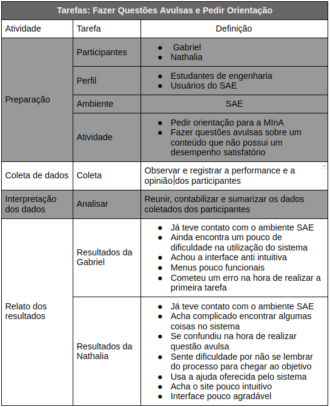

## Método de avaliação

### Avaliação de IHC através de Observação

O método de observação permite ao avaliador coletar dados sobre situações em que os participantes realizam suas atividades, com ou sem apoio de tecnologia computacional.  O registro e a análise desses dados permitem identificar problemas reais que os participantes enfrentaram, e não apenas problemas potenciais previstos pelo avaliador como em uma avaliação por inspeção. 

#### Teste de Usabilidade

O teste de usabilidade visa a avaliar a usabilidade de um sistema interativo a partir de experiências de uso dos seus usuários-alvo. Os objetivos da avaliação determinam quais critérios de usabilidade devem ser medidos. Esses critérios são geralmente explorados por perguntas específicas associadas a algum dado mensurável, que com frequência pode ser objetivamente capturado durante a interação do usuário com o sistema.

## Questionários:

Imagem 1: Termo de consentimento para realização do trabalho

### Pré-questionário
Qual é o seu nome?

Qual é o seu curso?

Em qual semestre você está?

Já usou/usa o SAE? Se sim, em qual matéria?

Qual é o seu nível de experiência com o SAE?

### Pós-questionário
Você se sentiu dificuldade em realizar as tarefas?

Que parte da interface e da interação o deixa insatisfeito?

Que parte da interface o desmotiva a explorar novas funcionalidades?

Ele entende o que significa e para que serve cada elemento de interface?

Alguma outra consideração?

Tabela 1: Atividades do teste de usabilidade

## Entrevistas

[Entrevista 1](https://youtu.be/7dQAjqh6NPo) 
<iframe width="560" height="315" src="https://youtu.be/7dQAjqh6NPo" frameborder="0" allow="accelerometer; autoplay; clipboard-write; encrypted-media; gyroscope; picture-in-picture" allowfullscreen></iframe>

[Entrevista 2 ](https://youtu.be/UWv3TnXoLBk) 
<iframe width="560" height="315" src="https://youtu.be/UWv3TnXoLBk" frameborder="0" allow="accelerometer; autoplay; clipboard-write; encrypted-media; gyroscope; picture-in-picture" allowfullscreen></iframe>

## Conclusão

Após a realização das análises de tarefas há alguns pontos que podem ser observados. O GOMS pode ser utilizado tanto quantitativamente, de modo a fornecer previsões sobre o tempo necessário para realizar tarefas. O KLM-GOMS apresentado acima afere o tempo que um usuário treinado no sistema leva para fazer uma tarefa simples. Esse tempo é bastante otimista, pois esses passos foram treinados repetidas vezes. Percebe-se que é um tempo elevado para realizar uma tarefa simples que poderia ser realizada em menos da metade do tempo, pois várias etapas são repetidas. O GOMS também pode ser utilizado qualitativamente, no sentido de auxiliar na elaboração de programas de treinamento, pois um modelo GOMS contém uma descrição detalhada do conhecimento necessário para realizar cada tarefa. O CMN-GOMS deixa fácil a identificação de métodos semelhantes, método atipicamente curtos ou longos se destacam e podem disparar ideias de design, como, por exemplo, a inclusão de botões de atalho para tarefas frequentes. Com as análises acima é possível perceber uma grande repetição de ações aparentemente desnecessárias, como por exemplo, ter que selecionar a turma para realizar qualquer objetivo dentro do sistema, mesmo que já tenha selecionado anteriormente para um outro objetivo também relacionado com a mesma turma.
 
As entrevistas também mostram que os usuários acham a interface pouco intuitiva. Sentem dificuldades na hora de realizar tarefas rotineiras por não se lembrarem os passos para chegar ao objetivo.

## Referencia 

[SIMONE DINIZ JUNQUEIRO BARBOSA, BRUNO SANTANA DA SILVA, Interação Humano-Computador, Capítulo 10 - Métodos de Avaliação de IHC 1a . Edição, Editora Campus, 2010.](https://aprender3.unb.br/pluginfile.php/581385/mod_resource/content/4/Cap.%2010%20Simone_Barbosa_Bruno-Interacao_humano_computador.pdf)

## Versionamento

Data | Versão | Descrição | Autor
---- | ------ | --------- | -----
05/10/2020 | 1.0 | Relato da Analise de tarefas | Rafael Ribeiro