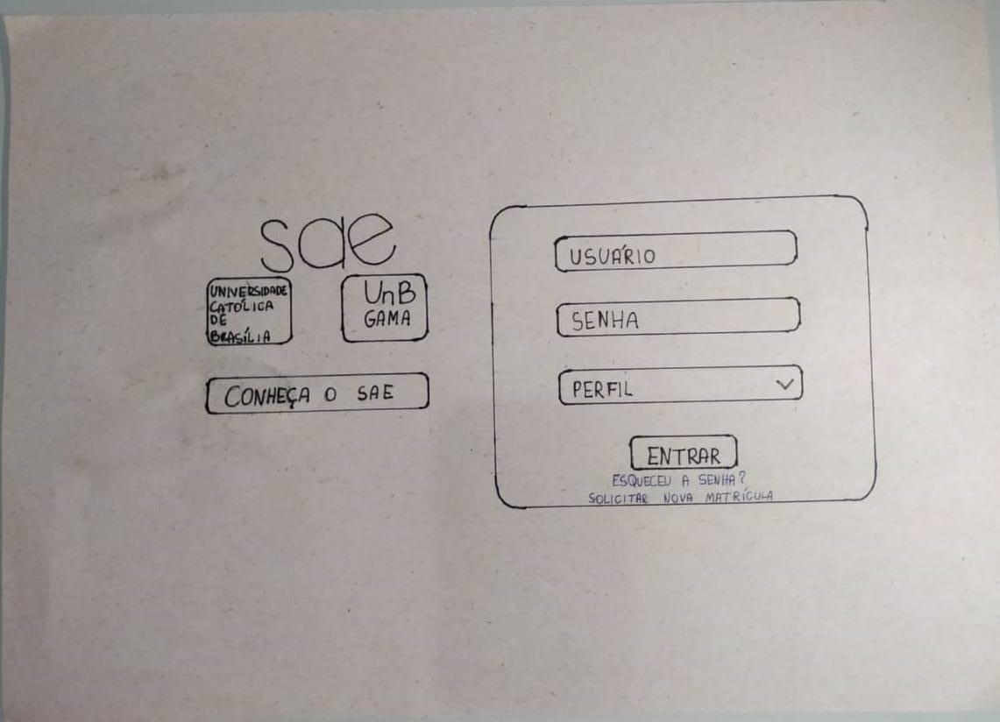
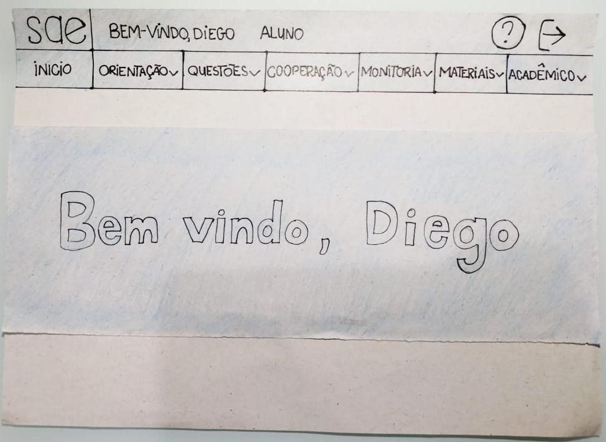
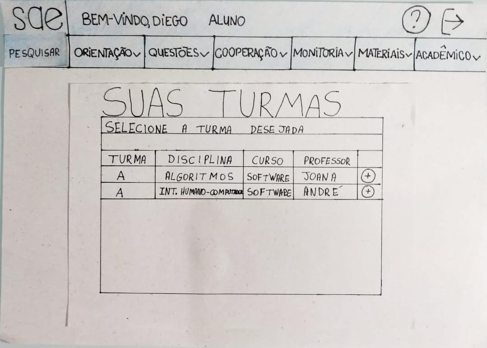
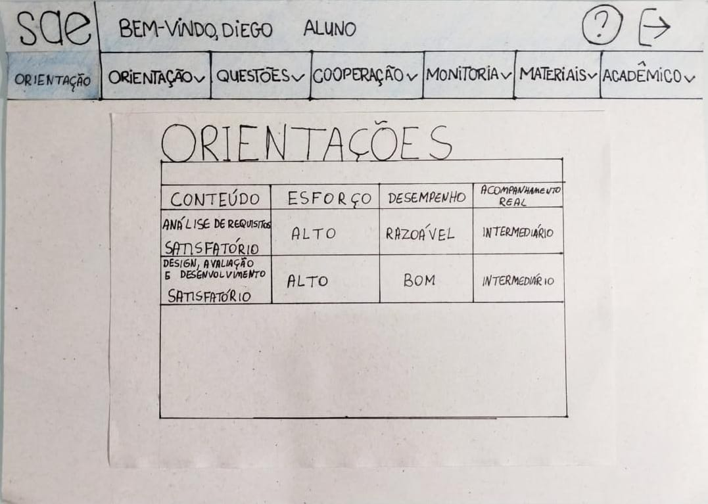

# Protótipo de Papel:

## Introdução:
O método de prototipação em papel (Snyder, 2003) avalia a usabilidade de um design de IHC representado em papel, através de simulações de uso com a participação de potenciais usuários. Simular o uso em papel é um modo rápido e barato de identificar problemas de usabilidade antes mesmo de construir uma solução de IHC executável. Sendo assim, esse método é uma opção interessante para uma avaliação formativa junto aos usuários, principalmente para comparar alternativas de design. Ele permite avaliar facilmente soluções parciais, que não cobrem toda a interface com usuário, e soluções de baixa e média fidelidade, que ainda não definem todos os detalhes da interface.

## Protótipo de Papel do SAE:
Com base no que foi citado acima, criamos um protótipo de papel para simular o funcionamento da nossa proposta para o SAE, focando no novo design, mostrando funcionamento do menu e ilustrando a tarefa de solicitar orientação, como descrita na análise de tarefas do ponto de controle anterior.

Figura 1 - Página de Login na Prototipação em Papel.

Figura 2 - Página inicial na Prototipação em Papel.

Figura 3 - Funcionamento do Menu Dropdown na Prototipação em Papel.

Figura 4 - Página que lista as turmas do aluno em Prototipação em Papel.

Figura 5 - Página que mostra as orientações de uma determinada matéria ao aluno em Prototipação em Papel.

Figura 6 - Foto geral das figuras produzidas para a Prototipação em Papel.

Figura 7 - Outro ponto de vista geral das figuras produzidas para a Prototipação em Papel.

## Conclusão:
Com o protótipo em papel, podemos ter uma ideia geral de como o design da interface deve ser e também podemos evitar que alguns erros sejam cometidos nas fases futuras do projeto.

## Referências:
SIMONE DINIZ JUNQUEIRO BARBOSA, BRUNO SANTANA DA SILVA, Interação Humano-Computador, 1a . Edição, Editora Campus, 2010.

## Versionamento:
 Data:      | Versão: | Descrição:           | Autor:                       |
|------------|---------|----------------------|------------------------------|
| 03/11/2020 | 1.0     | Criação do Documento com a Prototipação em Papel | Gabriel Paiva |
| 04/11/2020 | 1.1     | Adição da Introdução e da Conclusão | Murilo Gomes |