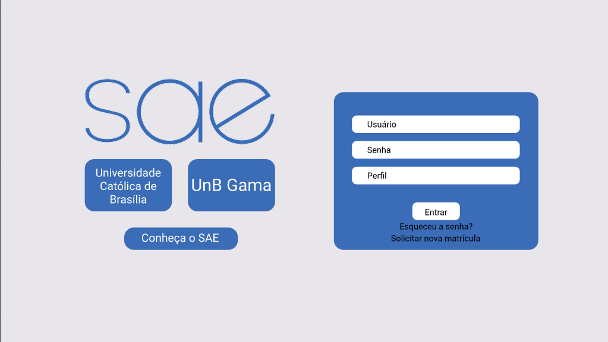
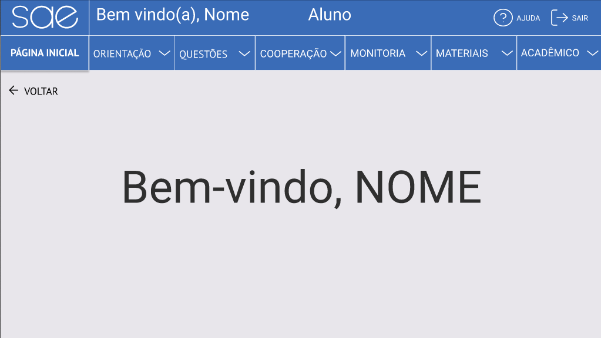
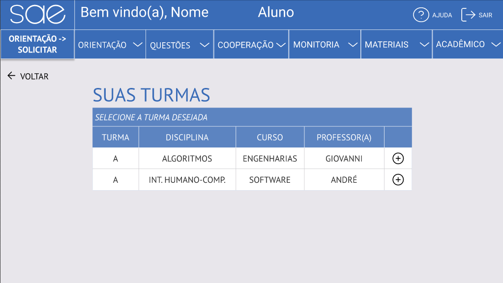
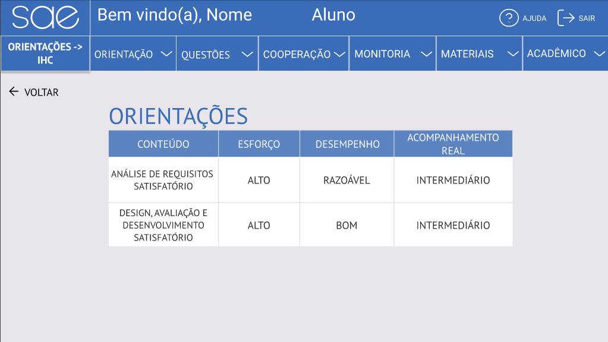
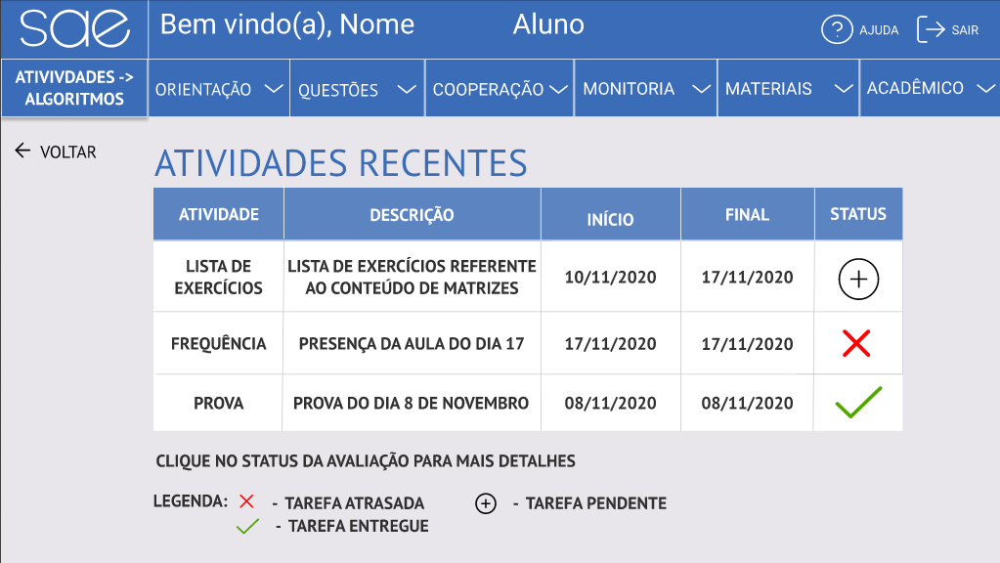
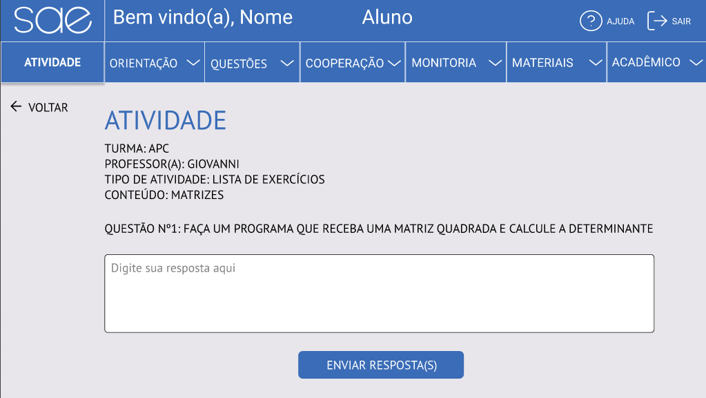
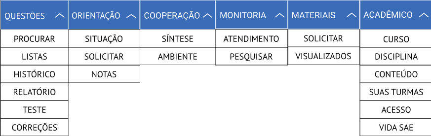

# Protótipo de Alta Fidelidade

## 1. Introdução:

A prototipagem de alta-fidelidade utiliza materiais que você espera que você espera que estejam no produto final e realiza um protótipo que se parece muito mais com algo acabado. A prototipação de alta-fidelidade é útil para vender ideias e testar questões técnicas do produto.

## 2. Objetivo:

Esse documento tem como objetivo final disponibilizar fotos das principais páginas criadas no protótipo de alta-fidelidade, comentando sobre a metodologia e tecnologia utilizada para prototipação do mesmo.

## 3 - Metodologia:

Para fazer o protótipo de alta-fidelidade foi utilizada a técnica de prototipação vertical que tem como objetivo fornecer bastante detalhes para apenas algumas funções da interface. A tecnologia utilizada para fazer o protótipo foi o [Figma](https://www.figma.com/).

## 4 - Protótipo:

**É possível interagir e testar o protótipo clicando [aqui](https://www.figma.com/proto/wOo7MZwkpXRJUtQa6RzedB/Prot%C3%B3tipo-de-alta-fidelidade?node-id=50%3A204&scaling=min-zoom).**

Figura 1: Página de Login

Figura 2: Página Inicial

Figura 3: Turmas do Aluno

Figura 4: Página de Orientações do Aluno

Figura 5: Página de Atividades Recentes do Aluno

Figura 6: Página de Entrega de Lista

Figura 7: Funcionamento do Menu Dropdown

## 5 - Conclusão:

Com o protótipo de alta-fidelidade, pode-se ter uma ideia melhor de como o visual do produto final deve ser, além de ajudar a evitar erros antes da implementação do projeto. Este documento também servirá para uma futura avaliação a ser feita sobre o protótipo.

## Referências:
* JENNIFER PREECE & YVONNE ROGERS & HELEN SHARP. Design de Interação: Além da interação homem computador. John Wiley e Sons. São Paulo - SP. 1ª Edição. Editora Érica, 2005.

## Versionamento:
 Data:      | Versão: | Descrição:           | Autor:                       |
|------------|---------|----------------------|------------------------------|
| 18/11/2020 | 1.0     | Criação do Documento com o Protótipo de Alta Fidelidade| Murilo Gomes e Rodrigo Tiago |

