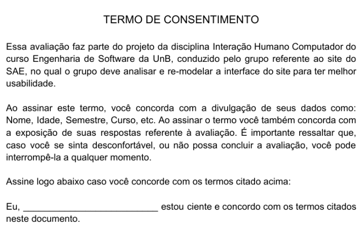

# Relato dos Resultados da Avaliação do Protótipo de Papel

## 1 - Introdução

Neste documento se encontra o relato dos resultados da Avaliaçãp do Protótipo de Papel do SAE. Essa avaliação tem como objetivo testar a usabilidade do protótipo de papel, verificando se as decisões de IHC tomadas em sua criação realmente alcançam as metas de usabilidade definidas no projeto.

## 2 - Participantes

Com base nas definições de Perfis de Usuários do SAE feitas anteriormente, foram recrutados três participantes para essa avaliação, que se encaixam nos perfis definidos. Eles são:

Eliseu Kadesh: Estudante de Engenharia de Software do 5° semestre, 21 anos.

Matheus Gomes: Estudante de Engenharia de Software do 5° semestre, 20 anos.

Washington Bispo: Estudante de Engenharia de Software do 5° semestre, 21 anos.

## 3 - Preparo

Como descrito no Planejamento da Avaliação do Protótipo de Papel, antes de realizar a avaliação, seguimos os seguintes passos:

- **Definir as tarefas para os participantes executarem:** Cada participante da avaliação terá que realizar a tarefa de **Solicitar Orientação** através do SAE. Vale ressaltar que essa tarefa já foi representada anteriormente em nossas [análises de tarefas](../PC4/Anlisedetarefa.md).
  Após a realização dessa tarefa, os participantes ainda tiveram que responder as seguintes questões:
    - Considerando 1 como Muito Difícil e 5 como Muito Fácil, como você classifica a complexidade de realizar essa tarefa?
    - Considerando 1 como Nada Intuitivo e 5 como Muito Intuitivo, como você classifica a usabilidade dessa interface?
    - Você tem sugestões para melhorar essa interface?
    - Tem algum elemento da interface que não está claro?

-   **Definir o perfil dos usuários e recrutá-los:** Utilizamos a descrição do perfil dos usuários já feita anteriormente para recrutar participantes. Portanto, nossos usuários serão: Estudantes de Engenharia de Software, entre 18 e 28 anos.    

-   **Criar o Protótipo de Papel criado para simular a execução das tarefas:** Utilizaremos o Protótipo de Papel apresentado no PC4 para simular o funcionamento do site e realizar a tarefa escolhida para essa avaliação.

### 3.1 Termo de Consentimento

Antes de realizar a Avaliação, também foi necessário criar um Termo de Consentimento para ser entregue aos participantes. Esse Termo pode ser visto a seguir:

 

Cada participante leu e assinou o termo antes de fazer a Avaliação. Além disso, os avaliadores se disponibilizaram a responder quaisquer dúvidas restantes referentes ao documento no início da Avaliação.

### 3.2 Teste Piloto

Antes da realização da Avaliação com usuários reais, fizemos um teste piloto para verificar se a Avaliação planejata tinha os requisitos necessários para alcançar os resultados esperados.

Essa avaliação foi feita com membros do próprio grupo da disciplina:

* Gabriel Paiva no papel de Avaliador.
* Murilo Gomes no papel de Usuário.

O Teste Piloto foi feito de forma remota, através do Microsoft Teams e pode ser visto no link a seguir:

[Teste Piloto](https://www.youtube.com/watch?v=hh2hUiACfHU&feature=youtu.be) 
<iframe width="560" height="315" src="https://www.youtube.com/embed/hh2hUiACfHU" frameborder="0" allow="accelerometer; autoplay; clipboard-write; encrypted-media; gyroscope; picture-in-picture" allowfullscreen></iframe>

 

Com a execução desse Teste-Piloto, chegou-se à conclusão de que o planejamento feito estava adequando para ser realizado com usuários e obteria os resultados esperados.

## 4 - Execução

A execução dessa Avaliação foi dividida em dois modelos, devido ao cenário de pandemia em que nos encontramos. Foi possível fazer somente uma avaliação de forma presencial (que fosse segura) e as outras foram feitas de forma remota utilizando o Microsoft Teams.

  - No modelo de avaliação presencial, o usuário realizou a tarefa sozinho, sendo o avaliador responsável somente pelos elementos interativos da interface, trocando as telas, menus e/ou botões quando necessário.

  - No modelo de avaliação remoto, o usuário assistiu a tela do avaliador, enquanto o informava dos passos que desejava realizar. O avaliador simulou a execução de cada um desses passos, trocando na tela os elementos da interface, até que o usuário concluiu a tarefa.

### 4.1 - Avaliação Presencial

A avaliação do protótipo de papel feita no modelo presencial, teve Matheus Gomes como participante. Pode ser conferida no vídeo abaixo:

[Avaliação Presencial](https://www.youtube.com/watch?v=zUdPB2t1q5U&feature=youtu.be) 
<iframe width="560" height="315" src="https://www.youtube.com/embed/zUdPB2t1q5U" frameborder="0" allow="accelerometer; autoplay; clipboard-write; encrypted-media; gyroscope; picture-in-picture" allowfullscreen></iframe>

 

Nessa avaliação presencial, as perguntas que foram feitas após a interação com o protótipo de papel não foram gravadas. Mas estão registradas e podem ser conferidas no Relato dos Resultados dessa avaliação.

### 4.2 - Avaliações Remotas

Foram feitas duas avaliações no modelo remoto, tendo Eliseu Kadesh e Washington Bispo como participantes. Podem ser conferidas nos vídeos abaixo:

**Avaliação Remota com Eliseu Kadesh:**

[Avaliação Remota com Eliseu Kadesh](https://www.youtube.com/watch?v=_sy_tjJuTZE) 
<iframe width="560" height="315" src="https://www.youtube.com/embed/_sy_tjJuTZE" frameborder="0" allow="accelerometer; autoplay; clipboard-write; encrypted-media; gyroscope; picture-in-picture" allowfullscreen></iframe>

 

**Avaliação Remota com Washington Bispo:**

[Avaliação Remota com Washington Bispo](https://www.youtube.com/watch?v=JxeuB-dUNYQ) 
<iframe width="560" height="315" src="https://www.youtube.com/embed/JxeuB-dUNYQ" frameborder="0" allow="accelerometer; autoplay; clipboard-write; encrypted-media; gyroscope; picture-in-picture" allowfullscreen></iframe>

 

## 5 - Relato dos Resultados

### 5.1 - Resultados

**Resultados da Avaliação Presencial:**

**Participante:** Matheus Gomes

**Conseguiu concluir a tarefa?** Sim.

**Tempo para realizar a tarefa:** 45 segundos (levando em conta o tempo gasto pelo Avaliador para trocar os elementos da interface).

**Erros cometidos:** 2
  - Clicou no indicativo de caminho atual.
  - Escolheu o menu de Questões.

**Questões:**

  **- Considerando 1 como Muito Difícil e 5 como Muito Fácil, como você classifica a complexidade de realizar essa tarefa?**

  Resposta: 3.

  **- Considerando 1 como Nada Intuitivo e 5 como Muito Intuitivo, como você classifica a usabilidade dessa interface?**

  Resposta: 4.

  **- Você tem sugestões para melhorar essa interface?**

  Resposta: "Poderia trocar os nomes dos menus para nomes mais intuitivos. E a parte que indica o caminho do site não está clara, parece um botão do menu."

  **- Tem algum elemento da interface que não está claro?**

  Resposta: "Como disse anteriormente, os nomes dos menus não estão tão claros e a parte que indica o caminho do site pode ser confundida com um botão do menu."

   

**Resultados da Avaliação Remota com Eliseu Kadesh:**

**Participante:** Eliseu Kadesh

**Conseguiu concluir a tarefa?** Sim.

**Tempo para realizar a tarefa:** 1 minuto 17 segundos (levando em conta o tempo gasto pelo Avaliador para trocar os elementos da interface).

**Erros cometidos:** 0

**Questões:**

  **- Considerando 1 como Muito Difícil e 5 como Muito Fácil, como você classifica a complexidade de realizar essa tarefa?**

  Resposta: 5.

  **- Considerando 1 como Nada Intuitivo e 5 como Muito Intuitivo, como você classifica a usabilidade dessa interface?**

  Resposta: 5.

  **- Você tem sugestões para melhorar essa interface?**

  Resposta: "Não."

  **- Tem algum elemento da interface que não está claro?**

  Resposta: "Não."

   

**Resultados da Avaliação Remota com Washington Bispo:**

**Participante:** Washington Bispo

**Conseguiu concluir a tarefa?** Sim.

**Tempo para realizar a tarefa:** 43 segundos (levando em conta o tempo gasto pelo Avaliador para trocar os elementos da interface).

**Erros cometidos:** 0

**Questões:**

  **- Considerando 1 como Muito Difícil e 5 como Muito Fácil, como você classifica a complexidade de realizar essa tarefa?**

  Resposta: 5.

  **- Considerando 1 como Nada Intuitivo e 5 como Muito Intuitivo, como você classifica a usabilidade dessa interface?**

  Resposta: 5.

  **- Você tem sugestões para melhorar essa interface?**

  Resposta: "Não."

  **- Tem algum elemento da interface que não está claro?**

  Resposta: "Escolher nomes mais significativos para o dropdown."

   

### 5.2 - Problemas Encontrados

**Problema n°1:** O cabeçalho que indica o caminho atual do site está parecido com um botão do menu dropdown, podendo causar confusão nos usuários.

**Problema n°2:** O nomes das abas do menu dropdown não claros o suficiente para os usuários, podendo causar confusão e dificultar a execução das tarefas no site.

### 5.3 - Possíveis Correções

**Problema n°1:** Modificar o design do cabeçalho que indica o caminho atual, diferenciando-o dos botões do menu dropdown, para não causar confusão.

**Problema n°2:** Escolher nomes mais significativos para os nomes das abas do menu dropdown, para deixar mais claro aos usuários o que encontrarão nessas abas e quais tarefas podem ser realizadas acessando-as.

## 6 - Conclusão

Com base nos resultados dessa Avaliação do Protótipo de Papel, foi possível notar os erros presentes na interface, que poderão ser corrigidos para melhorar a experiência do usuário e aplicadas no Protótipo de Alta Fidelidade.

## Referências

SIMONE DINIZ JUNQUEIRO BARBOSA, BRUNO SANTANA DA SILVA, Interação Humano-Computador, 1a . Edição, Editora Campus, 2010.

## Versionamento

 Data:      | Versão: | Descrição:           | Autor:                       |
|------------|---------|----------------------|------------------------------|
| 17/11/2020 | 1.0     | Criação do Documento com os relatos dos resultados da Avaliação | Gabriel Paiva |