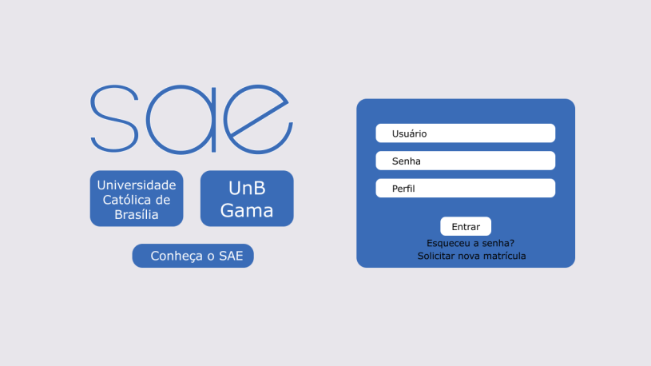
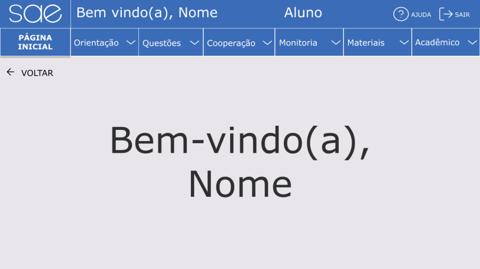
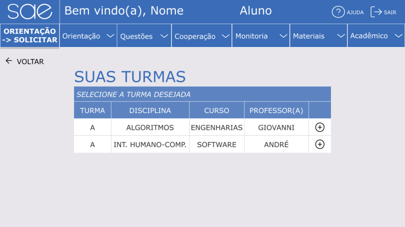
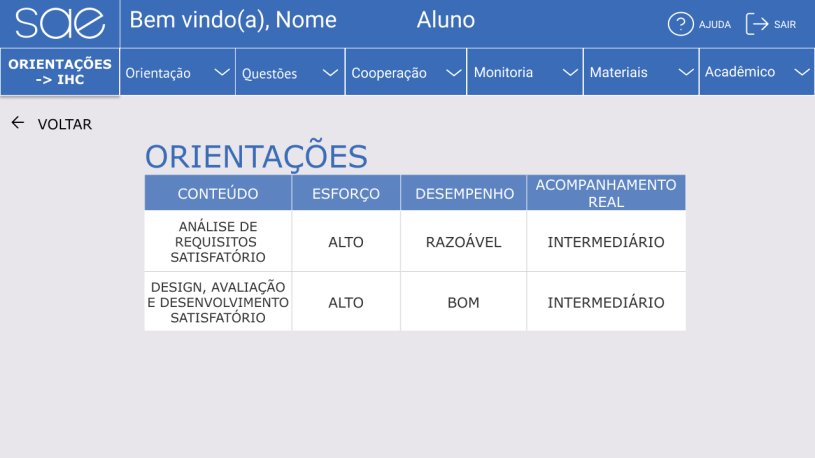
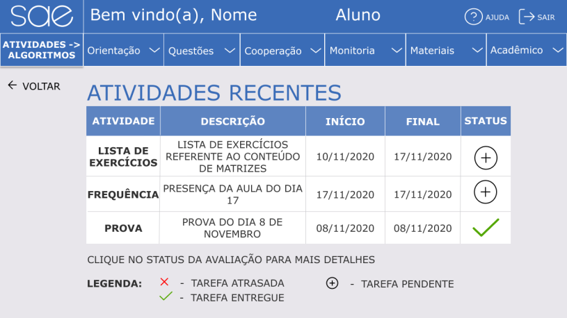
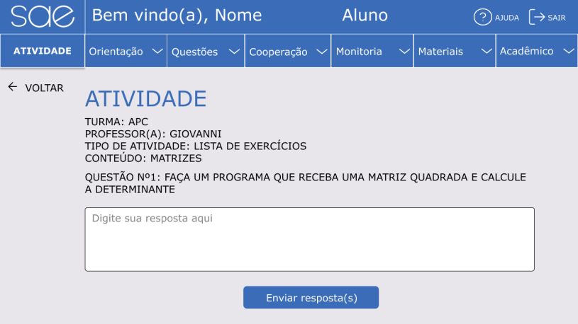
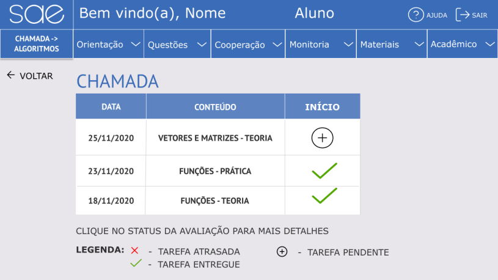
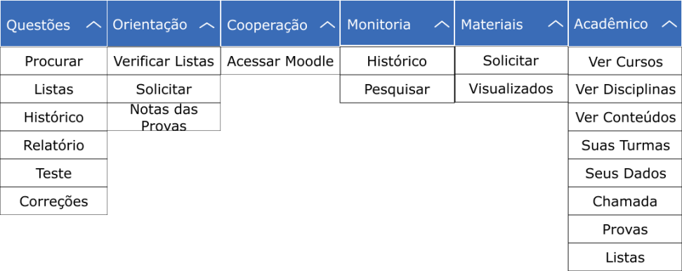

# Protótipo de Alta Fidelidade Versão Final

# Introdução

Após os testes com os usuários e feedbacks do professor e monitores sobre o Protótipo de Alta Fidelidade, foram feitas as devidas alterações no protótipo para melhor representar a versão ideal do projeto que foi desenvolvido. Esse documento tem como objetivo mostrar a versão final do projeto de IHC do SAE.

# Protótipo de Alta Fidelidade

## Alterações

As alterações mais recentes foram:

  - Adicionando nomes mais significativos às opções acessadas pelo menu dropdown para ajudar os usuários a acessar as tarefas.
  - Criando atalhos para tarefas importantes que os usuários tinham dificuldades de encontrar, como: assinar chamada, realizar prova e responder listas de exercícios.
  - Editando a estilização das páginas, utilizando caixa alta e negrito nas fontes somente nas partes que devem chamar mais atenção do usuário, por seu nível de importância (como requisitado no feedback com professor e monitores).

## Imagens

Figura 1: Página de Login

Figura 2: Página inicial do usuário

Figura 3: Página de Turmas

Figura 4: Página de Orientação

Figura 5: Página de Atividades Recentes

Figura 6: Página de Atividade

Figura 7: Página de Chamada

Figura 8: Menu Dropdown com novas opções

# Conclusão

Dessa forma, evidenciamos a versão final do Protótipo de Alta Fidelidade do SAE, aplicando os conhecimentos de IHC adquiridos durante o semestre. Passando por etapas desde o Planejamento, Análise de Requisitos, Design, Avaliação e Desenvolvimento, culminando nesse documento, que leva em conta as Metas de Estabilidade e Guia de Estilos definidos anteriormente, assim como as pesquisas e avaliações feitas com usuários reais, entre outras informações importantes.

# Versionamento

 Data:      | Versão: | Descrição:           | Autor:                       |
|------------|---------|----------------------|------------------------------|
| 30/11/2020 | 1.0     | Criação do Documento com a versão final do Protótipo de Alta Fidelidade | Gabriel Paiva e Murilo Gomes |