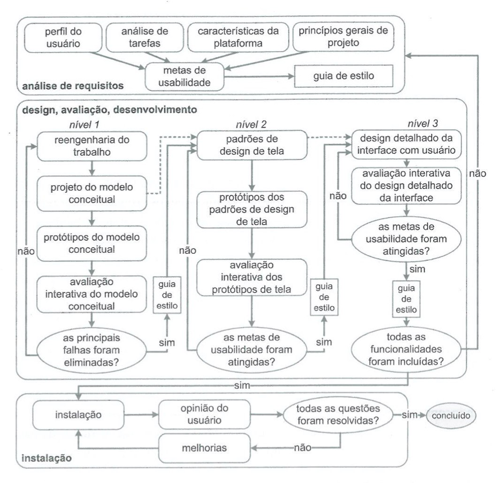

# Processo de Design

## 1 - Introdução

O design é um processo que envolve as seguintes atividades básicas: a análise da situação atual (identificação do problema), a síntese de uma intervenção e a avaliação dessa intervenção ou já aplicada à situação atual. Cada processo de design detalha essas atividades básicas de uma forma particular, definindo: como executar cada atividade; a sequência em que elas devem ser executadas; quais atividades podem se repetir, e por quais motivos; e os artefatos consumidos e produzidos em cada uma delas.

## 2 - Metodologia

Uma característica básica dos processos de design de IHC é a execução das atividades de forma iterativa, permitindo refinamentos sucessivos da análise da situação atual e da proposta de intervenção. Diante de vários processos de design que poderiam ser escolhidos a equipe decidiu utilizar a Engenharia de Usabilidade de Mayhew como processo de design da disciplina, pois este processo de design contém alta iteratividade, fazendo com que cada artefato seja avaliado antes de continuar para outro nível do projeto, o que se adequa a nossa proposta para o projeto.

## 3 - Engenharia de Usabilidade de Mayhew

Debora Mayhew (1999) propôs um ciclo de vida para a engenharia de usabilidade. Com uma visão holística, esse processo de design reúne e organiza diferentes atividades propostas na área de IHC para orientar o trabalho do designer em direção a uma boa solução interativa

O ciclo de vida de Mayhew é dividido em três fases:

**Análise de requisitos:** São definidas as metas de usabilidade com base no perfil dos usuários, análise de tarefas e princípios gerais de design de IHC, a partir destas metas é gerado um guia de estilo para guiar a equipe de design durante a fase dois.

**Design, avaliação e desenvolvimento:** Projeta a solução de IHC em 3 níveis de detalhes. No primeiro nível os avaliadores devem criar modelos conceituais pensando na execução das tarefas do usuário e como esses tarefas são executadas. No segundo nível são gerados padrões de design de telas, e algumas telas já prototipadas em protótipos de baixa fidelidade. No terceiro nível, o designer realiza o projeto detalhado da interface, com alta fidelidade, para ser implementado. No final de cada nível, os artefatos produzidos referentes a esse nível devem passar por uma avaliação para verificar se as metas de usabilidade foram atingidas.

**Instalação:** Nessa fase o designer deve recolher informações dos usuários depois de algum tempo de implantação do sistema.

## 4 - Conclusão:

Devido às características da Engenharia da Usabilidade de Mayhew citadas anteriormente, a equipe resolveu aplicar esse processo de design no projeto que será feito na disciplina, buscando o desenvolvimento da melhor solução de IHC possível, utilizando o site do SAE como base.

## Referências:
SIMONE DINIZ JUNQUEIRO BARBOSA, BRUNO SANTANA DA SILVA, Interação Humano-Computador, 1a . Edição, Editora Campus, 2010.

## Versionamento

Data | Versão | Descrição | Autor
---- | ------ | --------- | -----
30/11/2020 | 1.0 | Criação do documento com o ciclo de vida usado no projeto | Murilo Gomes, Gabriel Paiva e Rodrigo Lima 
