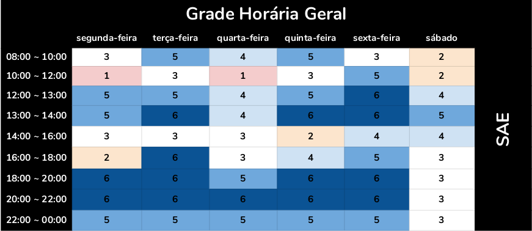

Planejamento
---------------

O planejamento é uma ferramenta administrativa, que possibilita perceber
a realidade, avaliar os caminhos, construir um referencial futuro, o
trâmite adequado e reavaliar todo o processo a que o acoplamento se
destina

Introdução 
---------------

 O Planejamento consiste da preparação, organização e estruturação do projeto. É essencial na tomada de decisões e execução dessas mesmas tarefas. Posteriormente, o planejamento também a confirmação se as decisões tomadas foram acertadas. Portanto, o planejamento serve para auxilar o grupo a se organizar nas tarefas que serão propostas durante o projeto, de acordo com as respectivas datas de entrega. 

Heatmap 
---------------

Cronograma 
---------------

 A seguir, estão descritas todas as datas importantes de entrega da equipe moldado no plano de ensino da matéria. Para cada ponto de controle, estão definidas ao menos duas reuniões presenciais, à priori marcadas para acontecer no sábado, mas que podem ser remarcadas caso seja necessário. Além disso, reuniões à distância ocorrerão sob demanda, conforme for necessário para o desenvolvimento do projeto. É importante salientar também que o cronograma está sujeito a mudanças que, caso ocorram, serão rastreadas no versionamento da página. 

  Atividade   |   Data    |   O que deve ser apresentado
----------- | --------- | ------------------------------
  <i></i>| 10/09 | Reunião inicial do grupo para avaliar os sites
  <i></i>| 15/09 | Definir o site a ser avaliado
  Reuniões | 18/09 | Divisão das tarefas
  <i></i>| 19/09 | Reestruturação do grupo e da divisão das tarefas
  <i></i>| 20/09 | Gravação da apresentação
  **Ponto de Controle 1**   |  21/09 | Planejamento do Projeto, equipe, litas de sites avaliados, site selecionado para o projeto da disciplina, Ferramentas do projeto, Processo de Design, cronograma das atividades
  <i></i>| 25/09 | Divisão das tarefas
  <i></i>| 27/09 | Reestruturação do grupo e da divisão das tarefas
  <i></i>| 29/09 | Reestruturação do grupo e alinhamento com os novos integrantes
  Reuniões | 30/09 | Escolher o site a ser avaliado e entrar em contato com o professor
  <i></i>| 01/10 | Realização das atividades em conjunto
  <i></i>| 03/10 | Realização das atividades em conjunto
  <i></i>| 04/10 | Gravação da apresentação
  **Ponto de Controle 2**   |   08/10 | Perfil do usuário, Personas e Análise de tarefas
  <i></i>| 10/10 | Correção de documentos
  Reuniões | 11/10 | Divisão das tarefas
  <i></i>| 13/10 | Realização das atividades em conjunto
  <i></i>| 14/10 | Gravação da apresentação
  **Ponto de Controle 3**   |   15/10 |Princípios Gerais de Projeto, Metas de usabilidade, Guia de Estilo. (Fase: análise de requisitos)
  <i></i>| 21/10 | Análise dos documentos enviados e das tarefas
  <i></i>| 25/10 | Reunião para alinhamento
  Reuniões| 26/10 | Realização das atividades em conjunto
  <i></i>| 27/10 | Realização das atividades pendentes
  <i></i>| 29/10 | Gravação da apresentação 
  **Ponto de Controle 4**   |   29/10 | Planejamento da Avaliação e do relato dosresultados da avaliação do Storyboard e Análise de tarefas.
  <i></i>| 30/11 | Divisão das tarefas
  Reuniões| 01/11 | Correção de documentos
  <i></i>| 03/11 | Realização das atividades em conjunto
  <i></i>| 05/11 | Gravação da apresentação
  **Ponto de Controle 5**   |   05/11 | Planejamento da Avaliação e o relato dos resultados da avaliação do Storyboard e Protótipo de Papel.
  <i></i>| 10/11 | Divisão das tarefas
  <i></i>| 15/11 | Correção de documentos
  Reuniões| 16/11 | Realização das atividades em conjunto
  <i></i>| 17/11 | Realização das atividades pendentes
  <i></i>| 18/11 | Gravação da apresentação
  **Ponto de Controle 6**   |   19/11 | Planejamento da Avaliação e o relato dos resultados da avaliação do protótipo de alta fidelidade.
  <i></i>| 22/11 | Análise das correções que deverão ser realizadas
  Reuniões| 25/11 | Realização das atividades em conjunto
  <i></i>| 27/11 | Realização das atividades pendentes
  <i></i>| 30/11 | Gravação da apresentação
  **Último ponto de controle** | **30/11** | **Entrega da apresentação do projeto final**

Ferramentas Utilizadas 
---------------
  Ferramenta  | Nome |  Descrição 
  :--------- | :------: | :-------:
   | [ZenHub](https://www.zenhub.com) | Subsistema no GitHub que permite gestão ágil do projeto/grupo com interface KanBan
   | [Github](https://github.com/) | Plataforma que será utilizada para gerir e unificar aquilo que o grupo desenvolver
   | [Google Drive](https://www.google.com/intl/pt-BR/drive/) | Plataforma para permitir a edição simultânea de arquivos por todos do grupo
   | [Telegram](https://web.telegram.org/#/login) | Ferramenta de comunicação para avisos gerais, marcar datas de reunião, entre outros
   | [Figma](https://www.figma.com/) | Ferramenta de comunicação para avisos gerais, marcar datas de reunião, entre outros
   | [Draw.io](https://app.diagrams.net/) | É um editor gráfico online no qual é possível desenvolver desenhos, gráficos e outros sem a necessidade de usar um software caro e pesado.

## Versionamento

Data | Versão | Descrição | Autor
---- | ------ | --------- | -----
20/09/2020 | 1.0 | Adição dos planejamento, heatmap, cronograma e ferramentas | Fellipe, Rafael, Itallo
14/10/2020 | 1.1 | Adição da ferramenta Figma | Gabriel Paiva e Murilo Gomes
30/10/2020 | 1.2 | Adição da ferramenta Draw Io e versionamento, mudança no heatmap | Rafael
30/11/2020 | 2.0 | Atualização das datas do cronograma de atividades | Rafael

Interação Humano-Computador 2020 SAE
[Github](https://github.com/Interacao-Humano-Computador/2020.1-SAE/).
All rights reserved. 