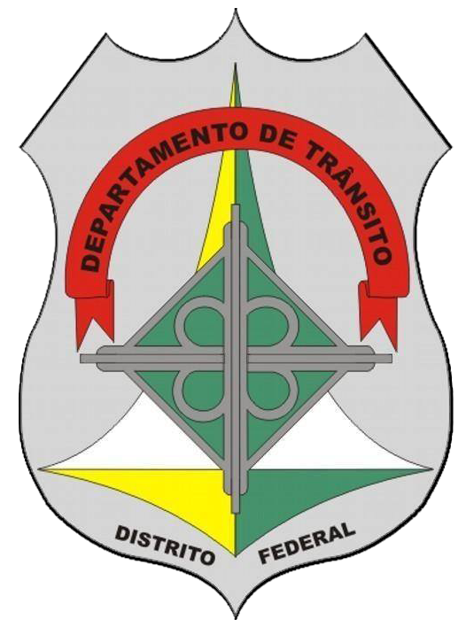
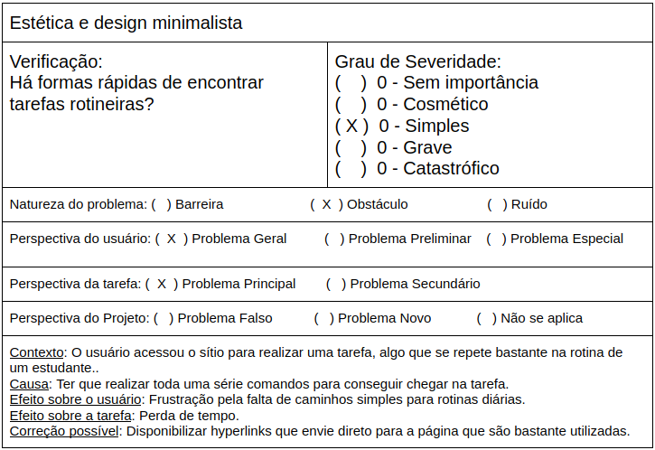

# Escolha do Site

## Sites analisados

Na tentativa de escolha de um site para ser avaliado durante a
disciplida de Interação Humano-Computador, cada integrante ficou
engarregado de pesquisar um site com um número razoável de problemas
para que seja proposto melhorias através do que foi aprendido com
o decorrer da disciplina.

<i></i> | Site | Sobre
--------|------|------
 | [gov.br](https://www.gov.br/) | O esse site é um projeto de unificação dos canais digitais do governo federal. Mas ele é, acima de tudo, um projeto sobre como a relação do cidadão com o Estado deve ser: simples e focada nas necessidades do usuário de serviços públicos.
 | [Anatel](https://www.gov.br/anatel/pt-br/) | A Agência Nacional de Telecomunicações é a primeira agência reguladora a ser instalada no Brasil, criada pela Lei 9.472, de 16 de julho de 1997.
 | [Saberes/Senado](https://saberes.senado.leg.br/) | O Saberes é um Ambiente Virtual de Aprendizagem – AVA, baseado no Moodle, que visa facilitar a aprendizagem. É nesse ambiente que o participante dos cursos a distância do ILB terá acesso aos conteúdos, realizará as atividades, enviará e receberá mensagens e terá acesso às suas notas e certificado
 | [DETRAN-DF](http://www.detran.df.gov.br/) | Os Departamentos Estaduais de Trânsito são os órgãos do Poder Executivo Estadual que fiscalizam o trânsito de veículos terrestres em suas respectivas jurisdições, no território Brasileiro. 
 | [SAE](https://sae.ucb.br/sae/) | O Sistema de Apoio Educacional(SAE) é um projeto originário de pesquisas envolvendo professores e estudantes de três instituições brasileiras de ensino superior (UCB, UFRGS e PUC-RS), que objetiva empregar recursos tecnológicos adequados a uma metodologia educacional coerente ao ensino-aprendizagem de alta qualidade, consistindo em um projeto multidisciplinar(Educação, Psicologia e Informática).

## Site Escolhido

### SAE

Avaliando o site através das heúristicas propóstas por Nielsen, foi possível encontrar alguns aspectos que poderiam ser melhorados no site. A seguir é mostrado a heurística de estética e design minimalista que foi realizado sobre o site.

Imagem 1: Heurística de estética e design

Além dos problemas encontrados na heurística supracitada, também há problemas na visibilidade de qual estado estamos no sistema, liberdade de controle fácil para o usuário, prevenções de erros, reconhecimento em vez de memorização, flexibilidade e eficiência de uso. Essa quantidade de problemas encontrados tornou viável a escolha do site para propostas de melhorias nessas áreas.
 
Devido a limitações de tempo do semestre, foram escolhidas as seguintes heurísticas para serem melhoradas no nosso projeto: estética e design, visibilidade de qual estado estamos no sistema, reconhecimento em vez de memorização e eficiência de uso.

## Referência

SIMONE DINIZ JUNQUEIRO BARBOSA, BRUNO SANTANA DA SILVA, Interação Humano-Computador, 1a. Edição, Editora Campus, 2010.

## Versionamento

Data | Versão | Descrição | Autor
---- | ------ | --------- | -----
27/11/2020 | 1.0 | Criação do documento | Realizado em conjunto por todos os integrantes